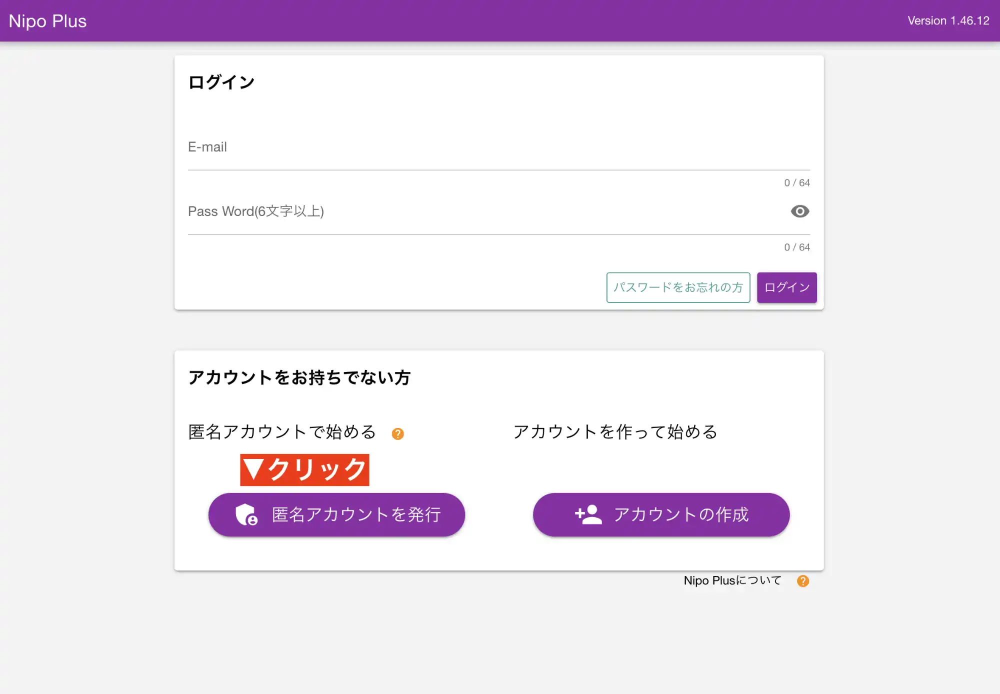
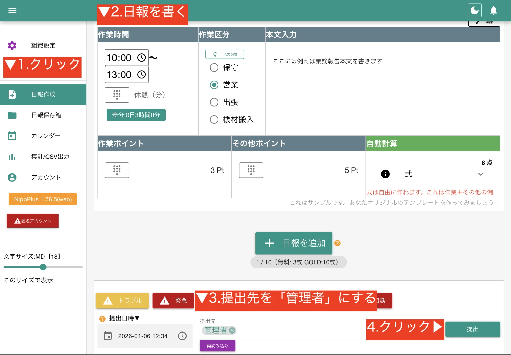
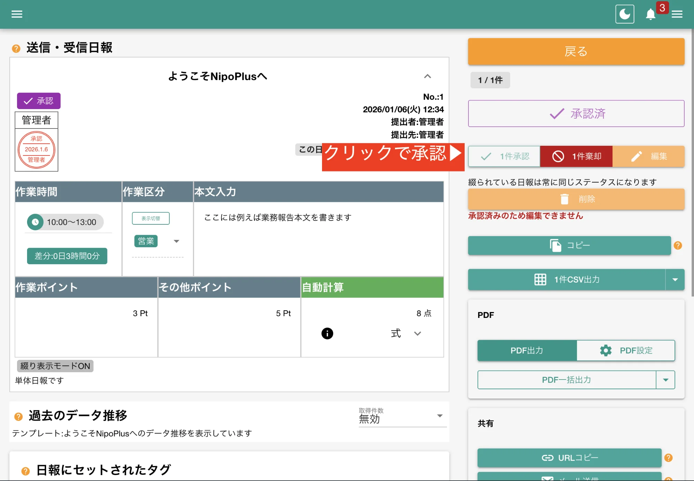

import { Steps } from '@astrojs/starlight/components'
import { LinkButton } from '@astrojs/starlight/components'

NipoPlusはスマートフォン・PC・タブレット上で動作する日報管理アプリです。
このガイドでは、NipoPlusを初めて使う方向けに必要最小限のステップで基本的な使い方をマスターできるように解説します。

## NipoPlusを起動

以下のボタンからNipoPlusを起動します。

<LinkButton href="https://nipoplus.sndbox.jp/" variant="secondary" target="_blank" icon="external">
  NipoPlusを起動
</LinkButton>

:::tip[ブックマークしておこう]
起動した先のページをブックマークしておけばいつでも簡単にアクセスできます
:::

## アカウントを作成する

[匿名アカウント](/nipoplus/reference/tokumei)を使えば、メールアドレスやパスワードの登録なしでNipoPlusをすぐに試すことができます。

<Steps>

1.  [匿名アカウントで始める](/nipoplus/reference/tokumei)をクリック
2.  確認メッセージが表示されたら「はじめる」をクリック
3.  [システム利用規約](/nipoplus/system/agree)に同意後、データ初期化が開始

    初期化には〜10秒ほどかかります

</Steps>

:::note[匿名アカウントはあとから正規アカウントに変更できます]
:::

## 初めての日報を書いてみよう

動きを知るにはまず、日報を書いてみるのが一番です。
この時点ではまだスタッフがあなたしかいませんので、自分宛てに[日報を書いて](/nipoplus/staff/writereport)みます。

<Steps>

1.  メニューから「日報作成」をクリック

    この時点で日報作成画面に切り替わります

2.  テンプレートに沿って報告内容を記入

    練習なので適当な内容でOKです

3.  提出先を「管理者」（あなたのアカウントです）に設定し、「提出」ボタンをクリック

</Steps>

:::tip[テンプレートはカスタム可能]
最初に表示されるテンプレートはサンプルです。後から[自由にカスタマイズ](/nipoplus/editor/template)できます。
:::

提出後は、次のいずれかのアクションを選択します。

<dl class="basic">
  <dt>続けて書く</dt>
  <dd>先ほど使用したテンプレートと同じテンプレートでもう一度日報を作成します</dd>
  <dt>テンプレートを変更</dt>
  <dd>テンプレート選択画面に移動します</dd>
  <dt>作成した日報を表示</dt>
  <dd>提出した日報を表示する画面にジャンプします</dd>
</dl>

「作成した日報を表示」を選んで、先ほど書いた日報を見てみます

## 日報を承認してみよう

先ほど書いた日報を表示して、見てみます。
自動で左のメニューが「日報保存箱」に切り替わっていると思いますが、もし変わっていなければ手動で切り替えてください。
承認ボタンをクリックし、日報を承認します。

## 次のステップへ進もう

お疲れ様でした。初めて日報を書き、承認するまでの一連の流れを体験できました。
ここでお伝えしきれていない内容がまだたくさんあります。

管理者は特に、スタッフの作成やテンプレートのカスタマイズなど、業務に合わせた設定が必要です。
