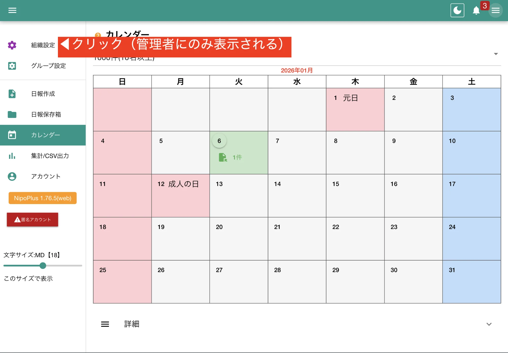
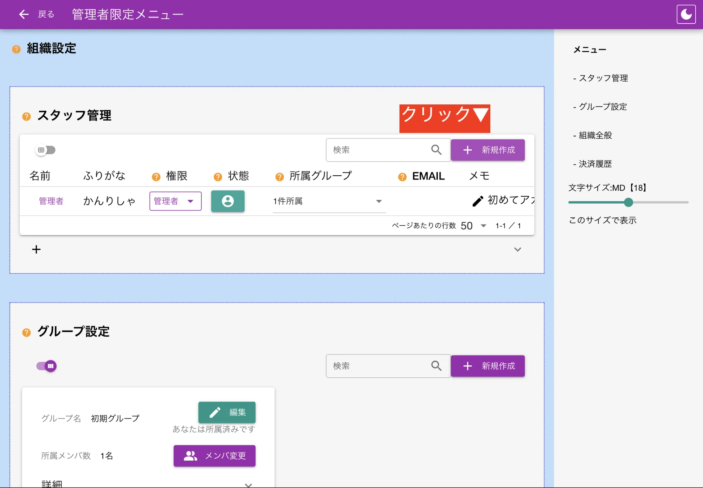
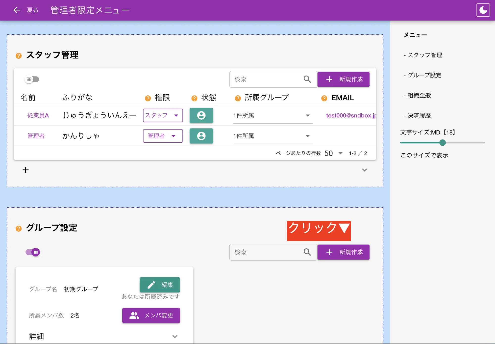

ようこそ。管理者様。
管理者はNipoPlusにおける最高権限です。
このページではNipoPlusの管理者アカウントが持つ役割についてまとめています。

## 管理者専用画面にアクセス {#adminPage}

メニュー左上にある「組織設定」をクリックし、管理者専用ページに移動しましょう。

## スタッフアカウントを作成する

NipoPlusを使用する従業員のためにアカウントを作成しましょう。

1. スタッフ管理内の新規作成ボタンをクリック
2. 必要事項を入力
3. 作成ボタンをクリック

参考資料:

- [スタッフ権限について](/nipoplus/reference/userRank/)
- [アカウント作成詳細ガイド](/nipoplus/reference/makestaff/)
- [スタッフの一括作成](/nipoplus/reference/makestaff/)

## グループを作成する

:::caution[小規模なケースでは不要]
もし１グループで運用する場合、このステップはスキップして下さい。
:::

グループは日報のやり取りが行われる「場所」です。部署ごとに分けたり、「新人研修会」のように一時的な利用目的で作ることも可能です。
グループごとに日報のテンプレートを作成したり、所属するスタッフを振り分けることができます。
「グループの作成」と「スタッフの振り分け」は管理者のみ行えます。

1. グループ管理内の新規作成ボタンをクリック
2. グループ名を入力
3. 作成ボタンをクリックして完了

## グループにスタッフを割り当てる {#join_staff}

スタッフをどのグループに所属させるかは管理者が指定します。

1. グループ設定内の設定したいグループ内にある「メンバ変更」をクリック
2. 所属させたいスタッフを選択
3. 保存ボタンをクリックして完了

:::tip[編集者権限のスタッフを最低１名以上配置]
グループ内の詳細な設定は「編集者権限以上」のスタッフが行えます。そのため、各グループには最低１名以上、編集者権限のスタッフを配置して下さい。
:::

## 管理者としての役割はここまで

以上で管理者としての基本的な役割は完了です。次のセクションでは各グループ内の細かい設定を行っていきましょう。
