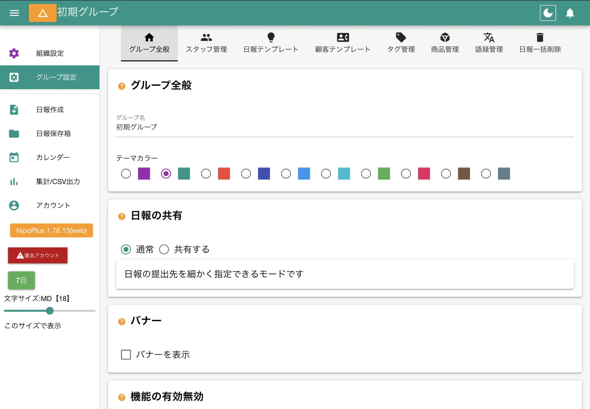

グループ全般の設定は次の手順でアクセスできます

1. 左メニューから「グループ設定」をクリック
2. 上タブから「グループ全般」をクリック（デフォルトで選択済み）

## グループ全般の設定 {#summary}

ここでは、グループの基本的な情報や、見た目に関する設定を変更できます。

<dl class="basic">
<dt>グループ名</dt>
<dd>グループの名称です。左上のグループ切替ボタンなどで表示されます。</dd>
<dt>テーマカラー</dt>
<dd>グループのテーマカラーを変更できます。アイコンの色やタイトルバーの色などが、指定したテーマカラーに一括で変わります。</dd>
</dl>

## 日報の共有の設定 {#reportShare}

グループ内で日報がどのように共有されるかを定義します。

<dl class="basic">
<dt>通常モード</dt>
<dd>日報の<a href="/nipoplus/gainen/destination/">提出先や共有先</a>を、日報作成時に細かく指定できます</dd>
<dt>共有モード</dt>
<dd>日報の提出先は指定できますが、共有先は自動的にグループ内の全員に設定されます。</dd>
</dl>

全員が全員の日報を読みたい場合は「共有モード」がおすすめです。

:::caution[日報が読めない権限もある]
「共有モード」でも[書き込みのみ権限・ゲスト権限](/nipoplus/reference/userRank/#others)は他人の日報を読めません
:::

## バナーの設定 {#banner}

グループの画面上部に、任意のお知らせ（アナウンス）を表示できます。

1. 画面上部にバナーを表示するのチェックをONにする
2. 表示するテキストを入力
3. OKボタンをクリック

## 機能の有効・無効を切り替える {#optionalFunction}

不要な機能はOFFにすることで左メニューをスッキリできます。

左メニューに追加される以外にも、軽微な変化が起こります。

<dl class="basic">
<dt><a href="/nipoplus/other/project/">案件</a></dt>
<dd>日報作成時に対象となる案件を入力する欄が追加されます。集計時に「案件集計」機能が利用可能になります。</dd>
<dt><a href="/nipoplus/other/schedule/">予定</a></dt>
<dd>カレンダーの表示設定に「予定」が追加されます。</dd>
<dt><a href="/nipoplus/reference/timecard/">タイムカード</a></dt>
<dd>日報作成画面にタイムカード打刻ボタンが追加されます。</dd>
<dt><a href="/nipoplus/reference/calendar/">カレンダー</a></dt>
<dd> メニュー追加以外に変化は有りません</dd>
<dt><a href="/nipoplus/staff/charts/">集計/CSV出力</a></dt>
<dd> メニュー追加以外に変化は有りません</dd>
<dt><a href="/nipoplus/reference/shift/">シフト管理</a></dt>
<dd> 提出簿において未提出者にメールを送る機能が有効化されます</dd>
<dt><a href="/nipoplus/reference/log/">ログ</a></dt>
<dd> 左メニューにログが追加されます</dd>
<dt><a href="/nipoplus/reference/relation/">引継ぎ</a></dt>
<dd> 日報作成時に「引継先」を指定する欄が追加されます</dd>
<dt><a href="/nipoplus/other/customer/">顧客管理</a></dt>
<dd> 編集者ページに「顧客テンプレート」の欄が追加されます</dd>
</dl>

## 現在の各種総数

グループ内のデータ総数を表示します

:::danger[保存を忘れずに]
設定した値は保存を押さない限り反映されません。
:::
