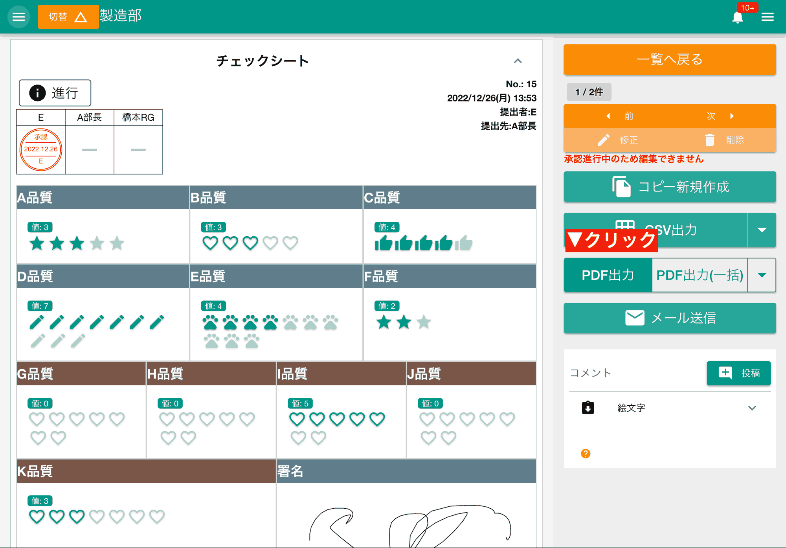
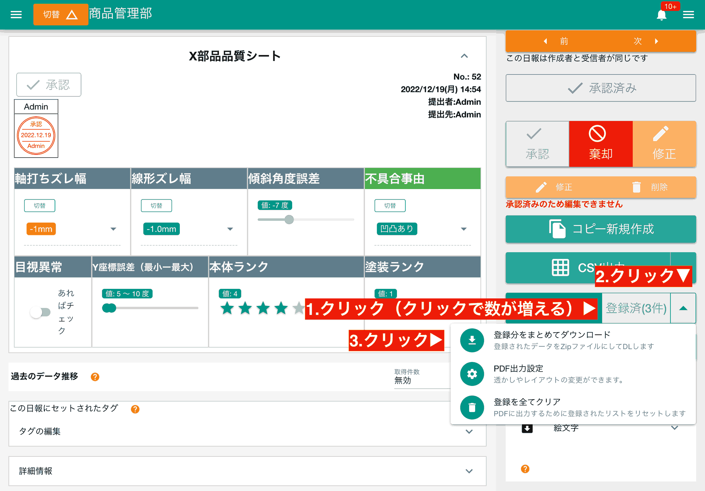
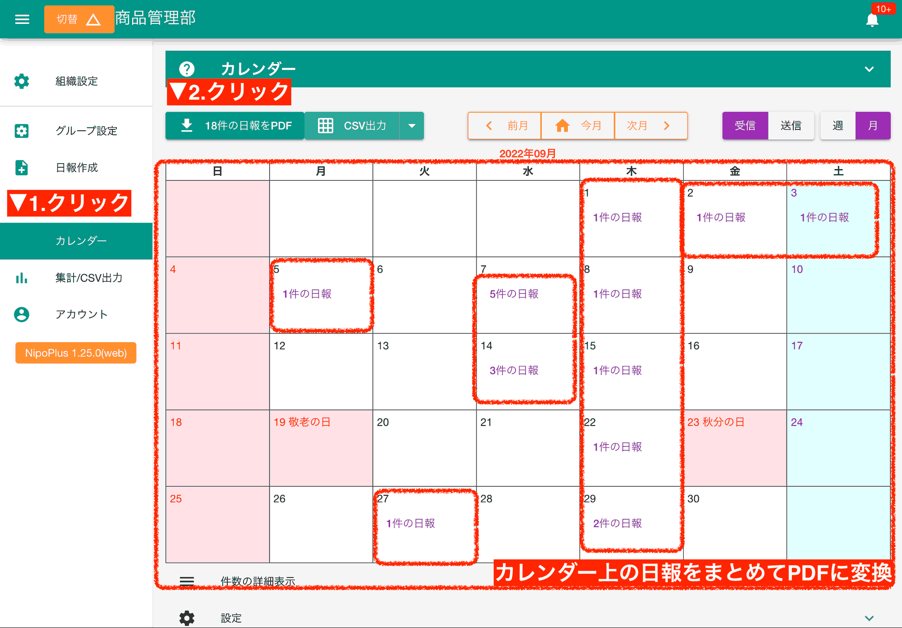
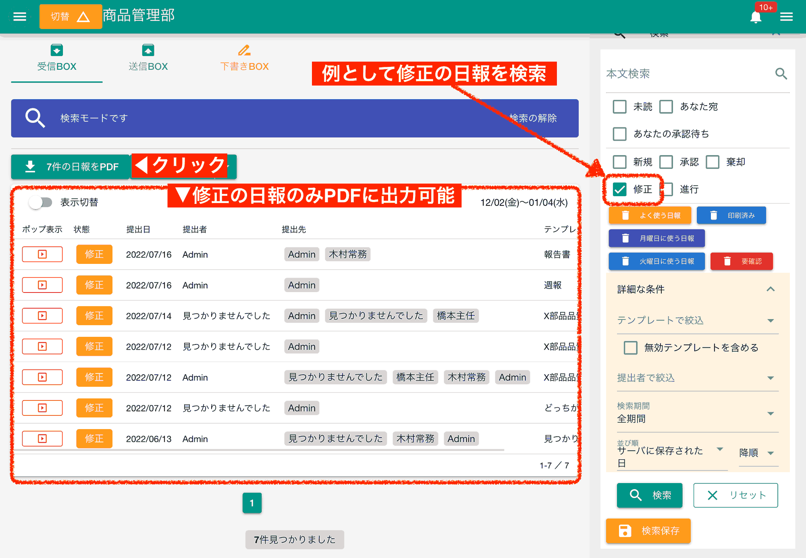

import { Badge, CardGrid } from '@astrojs/starlight/components'
import AutoTopicCard from '@components/AutoTopicCard.astro'
import TopicGrid from '@components/TopicGrid.astro'
import { Steps } from '@astrojs/starlight/components'
import { Image } from 'astro:assets'

<TopicGrid>
  <AutoTopicCard title="日報の表示" href="/nipoplus/staff/readreport" />
  <AutoTopicCard title="テンプレート編集" href="/nipoplus/editor/template#pdf" />
  <AutoTopicCard title="PDF出力設定" href="/nipoplus/reference/pdfsetting" />
</TopicGrid>

NipoPlusで提出された日報を簡単にPDFに変換できます。
個別の出力と一括出力があります。

## 日報1件をPDF出力する [#id=single_pdf]

<Steps>

1. PDFに変換したい[日報を表示](/nipoplus/staff/readreport)
2. PDF出力ボタンをクリック

</Steps>



PDF出力をすると、あなたのPCに日報PDFが保存されます。ファイル名は

```text
1741316223067.pdf
```

のようになります。

:::note[Web版との違い]
AndroidやiPhoneでもWeb版NipoPlusを使えば、共有機能は立ち上がらずタブとして表示されます。
:::

## 個別にPDF出力を登録して一括出力する [#id=convert]

<Steps>

1. PDF化したい[日報を表示](/nipoplus/staff/readreport)して「日報を一括PDFに追加」ボタンをクリック
2. 他のPDF化したい[日報を表示](/nipoplus/staff/readreport)して同様の作業を繰り返す(都度数が増えていく)
3. ▼ボタン（下向きの三角アイコン）をクリックし、「ダウンロード」をクリック
4. 2件以上追加した場合は、自動でZIPファイルに纏められてダウンロードされる

</Steps>



:::caution[一括PDF出力は50件を超えない範囲で操作してください]
:::

:::caution[モバイル版は使えません]
もしAndroidやiOSでこの機能が必要な場合は、[PWA版](/nipoplus/system/mobile-install)としてインストールしてください。
:::

:::note[ZIPファイルが文字化けする場合は[ZIPの文字化け対策](/tech/other/mojibake)をご覧ください]
:::

## カレンダー上に表示されている日報を一括でPDF出力する [#id=exportReportPDF]

カレンダー上に表示されている日報をまとめてPDF出力することができます。
フィルターで絞り込むことで、必要なPDFのみを効率よく出力可能です。

<Steps>

1. [カレンダー](/nipoplus/reference/searchreport/#calendar)を開く
2. 「◯件PDF」と表示されたボタンをクリック
3. PDF生成完了後ダウンロードする

</Steps>



## 受信BOXから日報を一括でPDF出力する [#id=box]

カレンダーと違い[受信BOX](/nipoplus/gainen/reportStorage/#inbox)では日報の絞り込み検索が可能です。
例えば[日報の状態](/nipoplus/reference/reportstate/)が修正のステータスになっているものだけをPDF出力するといったことができます。


