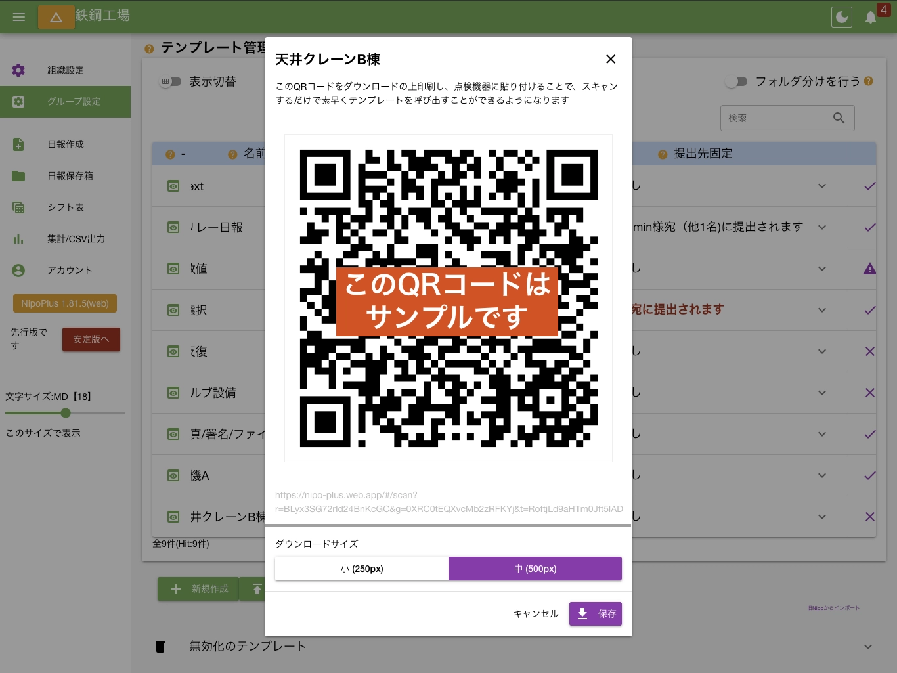
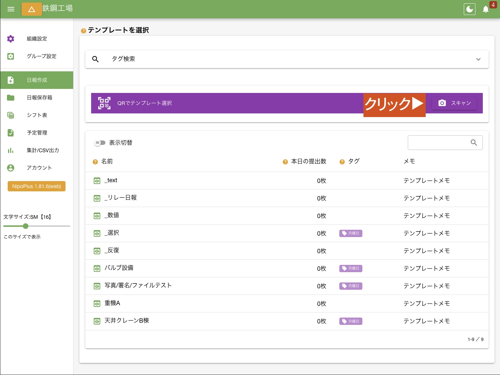

import { Badge, CardGrid } from '@astrojs/starlight/components'
import AutoTopicCard from '@components/AutoTopicCard.astro'
import TopicGrid from '@components/TopicGrid.astro'

<TopicGrid>
  <AutoTopicCard title="日報テンプレート" href="/nipoplus/editor/template" />
  <AutoTopicCard title="日報作成" href="/nipoplus/staff/writereport" />
</TopicGrid>

## QRコードで何ができる？簡単に点検用テンプレートの呼び出しが可能です [#id=qrtemplate]

通常は点検機器ごとに日報テンプレートを作成し、点検のたびにテンプレート一覧から選択して入力を開始します。  
しかし点検機器が多い場合、検索機能があるとはいえ一覧から探すのが「手間」に感じることでしょう。そのようなときはテンプレートに簡単にアクセスできるQRコードを活用しましょう。

## 点検機器用のQRコードを作成する [#id=create_qr]

1. 左メニュー「グループ設定」をクリック
2. 上部メニュー「日報テンプレート」をクリック
3. 作成したいテンプレート行にある「QR」ボタンをクリック

この手順でQRコードが画面上に表示されます。「ダウンロード」をクリックしてQRコードをPng画像として保存できます。

ダウンロードしたQRコードは印刷の上、点検機器に貼り付けるなどしてご利用ください。

## QRコードをスキャンして点検用のテンプレートを呼び出す [#id=scan_qr]

現場で実際に機器の点検を行う際は、次の手順で作業します。

1. 日報作成をクリック
2. QRコードスキャンをクリック
3. 点検機器に貼られたQRコードをスキャン

わずか3ステップで目的の点検用テンプレートを呼び出すことが可能です。

## NipoPlusを起動せずにカメラから直接スキャンする場合 [#id=direct_scan]

NipoPlusの「QRコードスキャン」ボタンが最もスムーズですが、点検員によっては直接カメラを起動してスキャンを試みる方もいらっしゃいます。
仮にカメラアプリから直接スキャンした場合、「PWA版のNipoPlus」が起動し、ログイン後にスキャンしたテンプレートの入力画面に自動で切り替わります。
