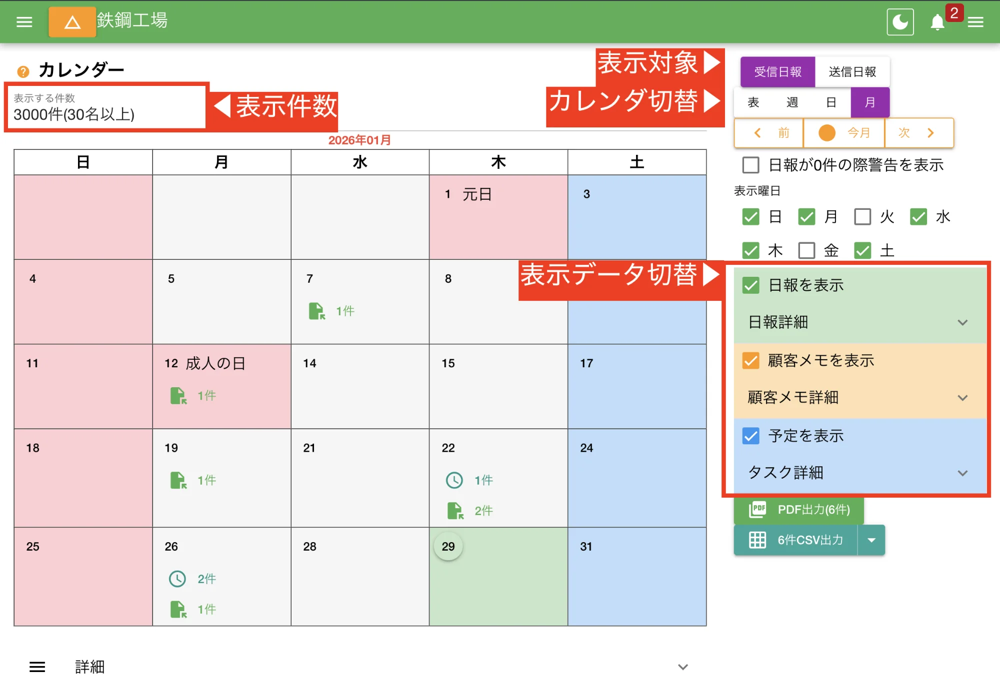
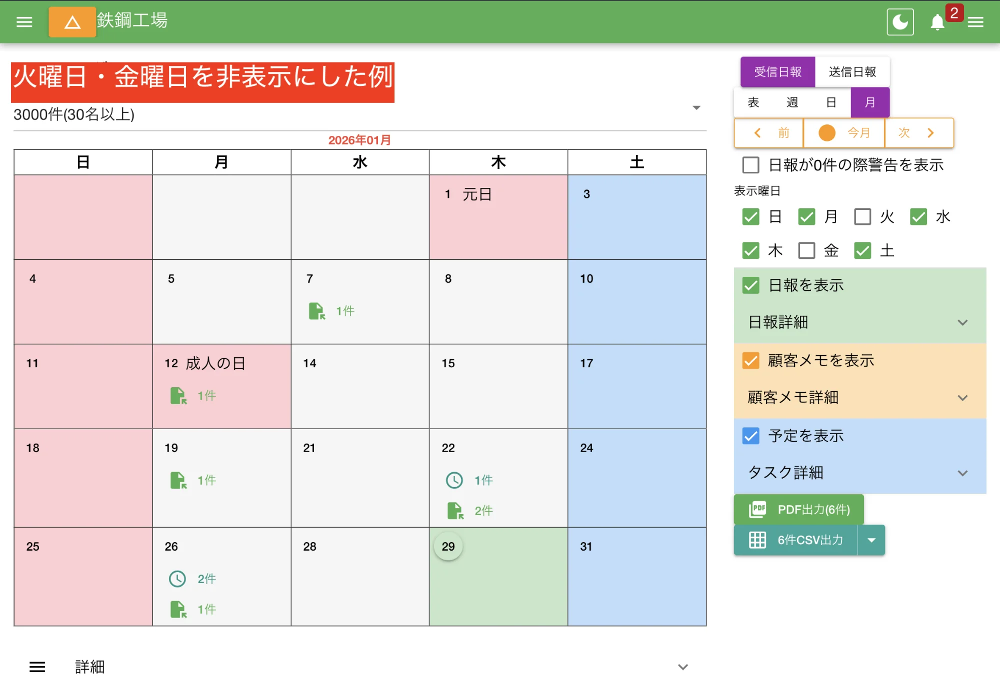
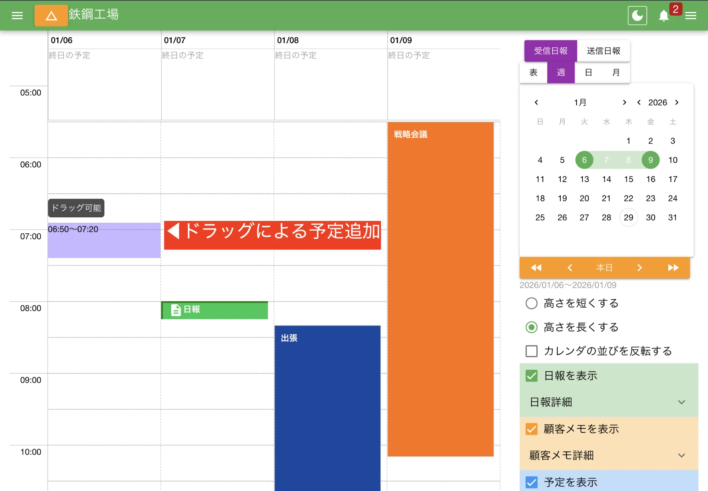
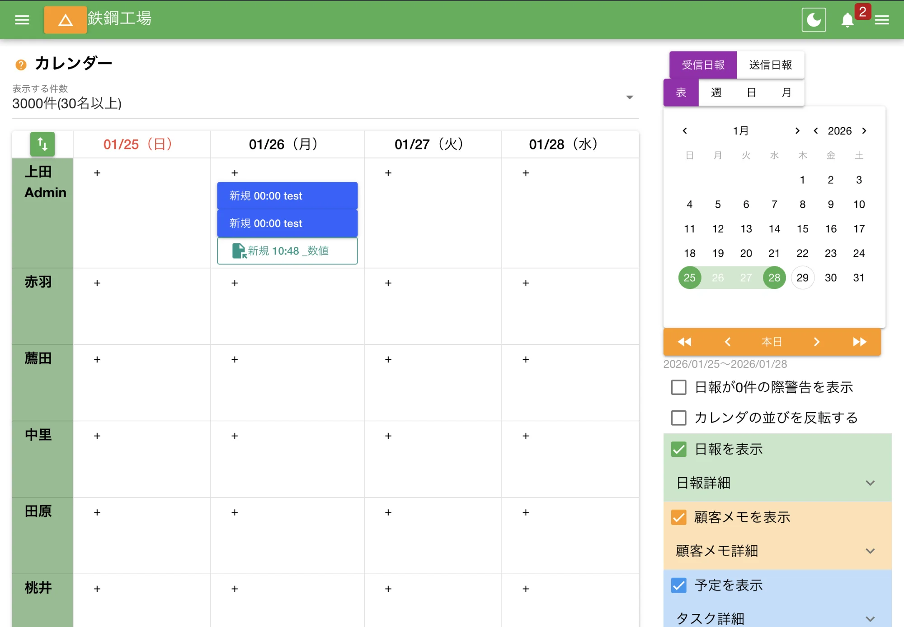
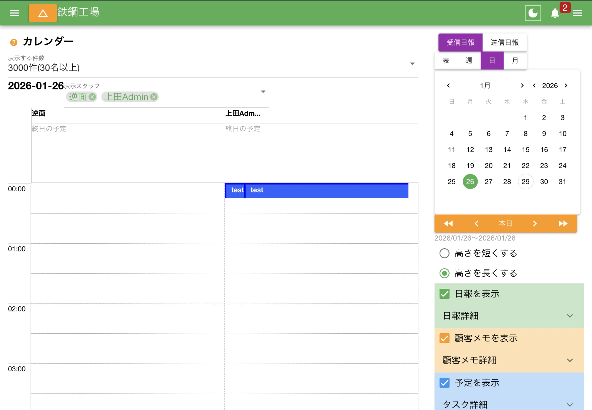

:::note[[メニューに無いときはグループ設定から機能を有効にしてください](/nipoplus/editor/groupmanage/#optionalFunction)]
:::

[日報](/nipoplus/reference/searchreport/#listbox)や[予定](/nipoplus/other/schedule)、顧客対応履歴などをデータをカレンダー上に表示できます。
カレンダーには表示形式の違いで「月間カレンダー」「週間カレンダー」「日カレンダー」「表カレンダー」があり、簡単に切り替えが可能です。

## カレンダーの表示設定 {#switch_dist}

カレンダーの表示切り替えは画面右上のパネルから操作します。

:::note[表示に関するは個人アカウントにのみ適用され、他のスタッフには影響しません]
:::

表示対象は以下の通り

<dl class="basic">
<dt>受信日報</dt>
<dd>自分が受け取った日報をカレンダーに表示します。保存箱の「受信BOX」と同じです</dd>
<dt>送信日報</dt>
<dd>自分が書いた日報をカレンダーに表示します。保存箱の<a href="/nipoplus/gainen/reportStorage/#outbox">送信BOX</a>と同じです</dd>
</dl>

カレンダ切替は以下の通り

<dl class="basic">
<dt><a href="/nipoplus/reference/calendar/">表</a></dt>
<dd>縦軸にスタッフ、横軸に日付の形をしたカレンダー。スタッフごとに提出状況を見たいときに便利。類似に<a href="/nipoplus/gainen/reportStorage/#map">提出状況表</a>がある</dd>
<dt><a href="/nipoplus/reference/calendar/">週</a></dt>
<dd>縦軸に時刻、横軸に日を表示したカレンダー。直近の全体の予定を俯瞰したいときに便利</dd>
<dt><a href="/nipoplus/reference/calendar/">日</a></dt>
<dd>縦軸に時刻、横軸にスタッフを表示したカレンダー。各スタッフの空き時間や予定を確認する際に便利</dd>
<dt><a href="/nipoplus/reference/calendar/">月</a></dt>
<dd>１ヶ月単位で表示</dd>
</dl>

表示データ切替は以下の通り

<dl class="basic">
<dt>日報を表示</dt>
<dd>カレンダー上に日報を表示する。別途表示基準日付の変更も可能。詳しくは次の表参照</dd>
<dt>予定を表示</dt>
<dd>カレンダー上に予定を表示する</dd>
<dt>顧客メモを表示</dt>
<dd>カレンダー上に顧客メモを表示する</dd>
</dl>

「日報を表示」では表示基準に関する設定も可能です。[日報は３つの日付をもつ](/nipoplus/gainen/reportdate)も参照して下さい。

<dl class="basic">
<dt>スタッフが指定した日付</dt>
<dd>日報を開いたとき、右上に表示される日付のことです。この日付を基準にカレンダ上に日報を配置します</dd>
<dt>サーバ上の最終更新日時</dt>
<dd>日報の最終更新日を基準にカレンダ上に配置します。日報を修正したりするとカレンダ上の表示もずれます。（日報保存箱はこのモードです）</dd>
<dt>サーバ上の最初の保存日時</dt>
<dd>当該日報が初めてサーバに保管された日を基準にします。日報の修正をしても変化しません。ただし宵越しで提出された日報が正しい日に表示されない点に注意が必要です</dd>
</dl>

:::note[日報受信BOXとは何が違うの？]
日報受信BOXは細かい検索や絞り込みができ、カレンダーは全体の俯瞰に適しています
:::

---

## 月間カレンダー {#calendar_switch_month}

- 月カレンダーは１ヶ月単位のデータを表示します
- 不要な曜日があればその曜日を非表示にすることもできます
- カレンダー上に表示されている日報をクリックするとポップアップで内容が表示されます（同日に複数の日報がある場合はページネーションが組まれる）
- 日付ボタンをクリックすると予定の登録も可能

月カレンダ上の「日」はボタンになっており、クリックすることで予定を追加することができます。

[予定登録](/nipoplus/other/schedule)も参照してください。

---

## 週カレンダー {#calendar_switch_week}

- 任意の期間にわたる日報や予定を確認できるカレンダーです
- 予定や日報を時系列に確認したい際に便利です
- マウス操作で簡単に予定を登録できます

週カレンダー専用の設定には以下の項目があります。

<dl class="basic">
<dt>高さを短く（高く）する</dt>
<dd>縦軸の長さを切替できます。短くするとスクロールが少なくて済みますが、予定が密集すると過密になり視認性が落ちます</dd>
<dt>カレンダの並びを反転する</dt>
<dd>列の並びを逆転させます。ONだと左端が最も未来の日付となり、OFFだと左端が最も古い日付になります</dd>
</dl>

時間軸上でドラッグすることで指定範囲に対して予定を追加できます。

:::caution[スマートフォンはスクロールとドラッグの動きが同じため少しコツが要る]
スマートフォンでは、時間軸に指をおいて1秒ほどホールドし、「ドラッグ可能」と表示が出たらドラッグを開始してください。
:::

[予定登録](/nipoplus/other/schedule)も参照してください。

---

## 表カレンダー {#calendar_switch_map}

- スタッフごとの予定や日報を一目で確認できます
- 表示期間は任意に変更できます

スタッフの並び順は任意に変更できます。

1. 表カレンダーの一番左上にあるボタンをクリック
2. ドラッグで任意の順に並べ替える
3. 表示したくないスタッフは「表示しない」にチェックを入れる

各セルに配置された「＋」ボタンをクリックすることで、簡単に予定を追加できます。

[予定登録](/nipoplus/other/schedule)も参照してください。

---

## 日カレンダ {#calendar_switch_day}

- １日単位で表示するカレンダーです
- 同時に表示できるスタッフは３名までです
- 予定のすり合わせなど、横軸のすり合わせに便利です

日カレンダーでは、予定の開始から終了までの時間が色付きのボックスで表示されますが、いくつか特徴的なルールがあります。

- 1日の内20時間を超えると「終日予定」に分類されます（24時間ではありません）
- 予定の時間が30分未満（例えば12:00〜12:10）の場合でも30分の範囲を専有します（視認性確保のため）
- 予定に複数の担当者がセットされている場合、同じ予定がスタッフそれぞれの列に表示されます（重複と勘違いしないよう注意）
- 同時刻に予定が重なるとズレて表示されます。ズレは重なるごとに右へ徐々にシフトします
