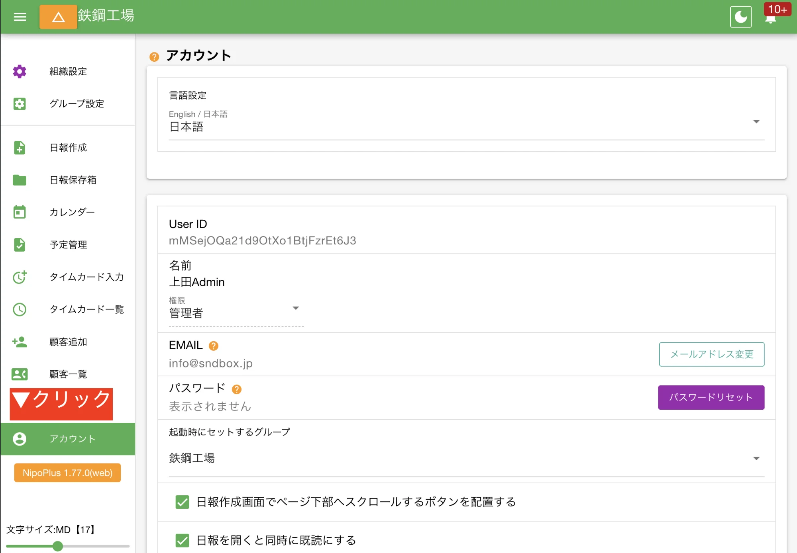

## ログイン中のアカウント情報を確認する {#myAccount}

現在ログインしているアカウント名や権限など、個別の情報を知るには左パネルメニューから「アカウント」をクリックします。

メール通知の受信設定や、言語設定についてもこの画面から変更が可能です。

<dl class="basic">
<dt>言語設定</dt>
<dd>メニューやタイトルを他の言語に変更できます。現在は日本語、英語に対応しています</dd>
<dt>User ID</dt>
<dd>現在ログイン中のアカウントのIDです</dd>
<dt>名前</dt>
<dd>現在ログイン中のアカウントにセットされた名前です。名前の変更は組織設定から行います</dd>
<dt>権限</dt>
<dd>現在ログイン中のアカウントの権限です</dd>
<dt>EMAIL</dt>
<dd>ログイン中のアカウントが使用しているEmailです。ログイン時に使用します。各自で独自に修正することも、管理者が変更することもできます</dd>
<dt>パスワード</dt>
<dd>ログインに使用するパスワードです。表示されません。パスワード変更には管理者権限、またはログインメールアドレスが必要です</dd>
<dt>起動時にセットするグループ</dt>
<dd>複数のグループに所属している場合に有効です。NipoPlus起動時に最初にロードするグループを変更できます。指定しない場合は所属済みのグループから１つ無作為に選択されます</dd>
<dt>日報作成画面でページ下部へスクロールするボタンを配置する</dt>
<dd>日報作成時に、一番下へスクロールするボタンを配置します。デフォルトはOFFです</dd>
<dt>日報を開くと同時に既読にする</dt>
<dd>日報を開いたタイミングで既読がセットされます</dd>
<dt>日報を開くと同時に承認する</dt>
<dd>あなたが承認可能な日報を開いたとき、自動で承認が実行されます</dd>
<dt>通知をクリックと同時に当該通知を削除する</dt>
<dd>通知をクリックするとそのページに遷移すると同時にその通知が一覧から削除されます</dd>
<dt>日報詳細表示時に右パネルを折りたたむ</dt>
<dd>詳細表示時に右パネルを非表示にします</dd>
<dt>メール通知を使う</dt>
<dd>日報が提出されたタイミングでメール通知を受け取りたいときはONにします</dd>
<dt>キャッシュクリア</dt>
<dd>端末内に保存されているキャッシュデータを削除します。動作が不安定な時や設定の反映がされないときはキャッシュをクリアすることで解決する可能性があります</dd>
<dt>APIキー</dt>
<dd>API機能を使う場合はここからAPIキーを取得できます</dd>
<dt>お問いあわせフォーム</dt>
<dd>NipoPlusのアプリからお問い合わせが可能です</dd>
<dt>エラーログ</dt>
<dd>ご利用中に発生したエラー（軽微・重度）が端末内にストックされます。エラーログを開発者に共有することでバグ修正に役立ちます。エラーログがある場合は共有のご協力をお願いします</dd>
</dl>
