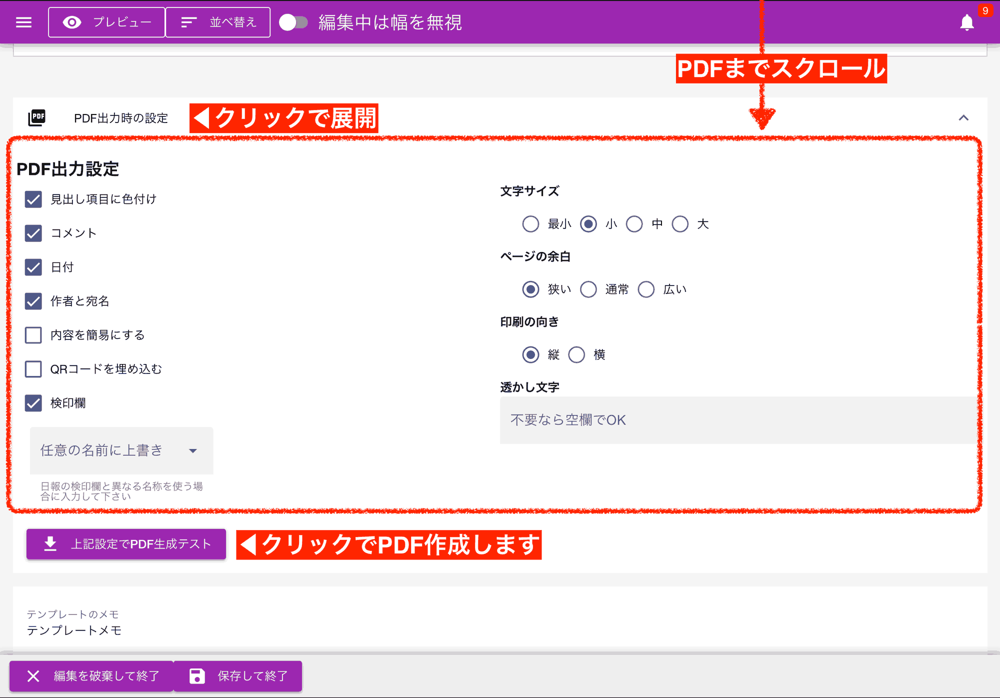
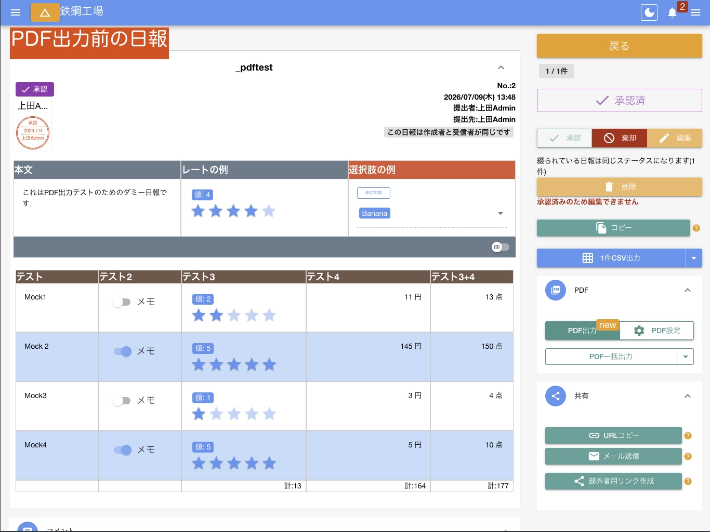
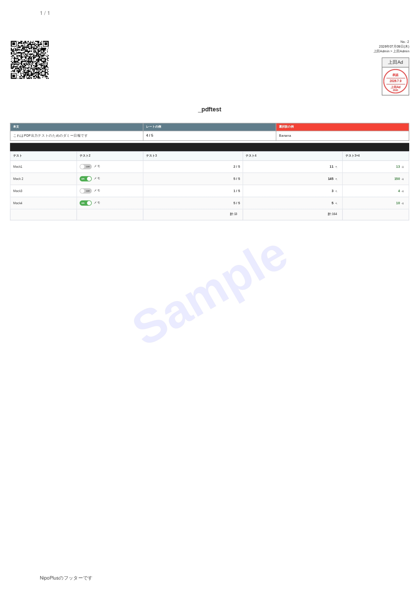
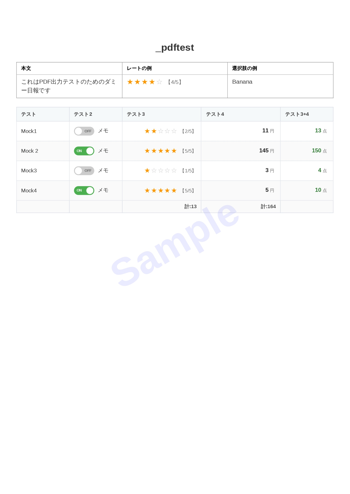
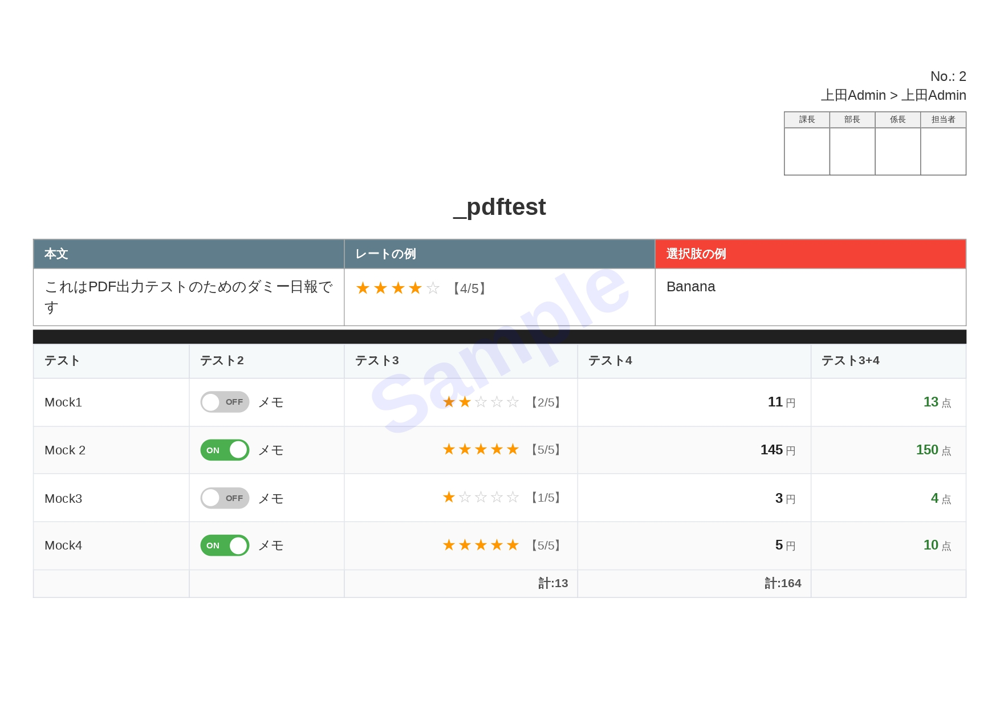
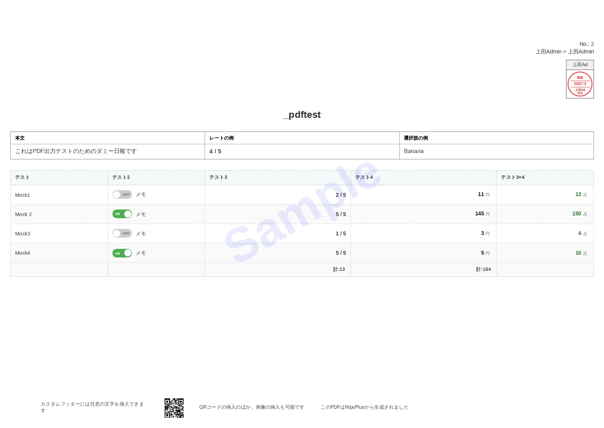

import { Badge, CardGrid } from '@astrojs/starlight/components'
import AutoTopicCard from '@components/AutoTopicCard.astro'
import TopicGrid from '@components/TopicGrid.astro'
import { Steps } from '@astrojs/starlight/components'
import { Image } from 'astro:assets'
import singleSetting from './img/pdfSettingSingle.webp'
import singleSetting2 from './img/pdfSettingSingle2.webp'

<TopicGrid>
  <AutoTopicCard title="🖨️日報をPDFに変換する" href="/nipoplus/staff/pdf" />
</TopicGrid>

## PDF出力設定は永続と単発の2種類 [#id=edit]

日報をPDFに出力する際、文字サイズやレイアウトなどの出力設定が行なえます。設定は永続の設定と、単発の設定の2種類があります。

<dl class="basic">
  <dt>
    <a href="#setDefault">初期値の変更(永続)</a>
  </dt>
  <dd>
    <a href="/nipoplus/editor/template/#pdf">日報テンプレート編集</a>から行います。 一度設定するとデフォルト値として記録されます。
  </dd>
  <dt>
    <a href="#once">一時的な変更(単発)</a>
  </dt>
  <dd>日報表示画面から行います。1回限り有効な設定で、変更内容は保存されません </dd>
</dl>

### 永続的な設定を行う [#id=setDefault]

[テンプレート編集](/nipoplus/editor/template/#pdf)からPDF出力設定を行うと、初期値として記録されます。
PDF設定はテンプレート編集画面の中程までスクロールしていただくと設定項目が見えてきます。
この設定は「テンプレート単位で保存される」ことに留意してください

### 1度限り有効な設定を行う [#id=once]

PDF出力前に設定することで、1回限りの設定を記録できます。この設定は一括出力でも単体出力でも有効ですが、一度出力すると設定はクリアされます。

<Steps>

1.  PDF設定ボタンをクリック

        <Image src={singleSetting} alt="PDF出力設定（単発）" class="rounded-xl" />

1.  PDF設定画面がポップアップで表示される

        <Image src={singleSetting2} alt="PDF出力設定（単発）" class="rounded-xl" />

1.  設定を行い、「現在の設定でPDF出力」をクリック

    クリックした時点の設定で出力がなされます。なお、日報本文なども出力前に変更できます。変更の内容は保存されません。
    「PDF一括出力に追加」をクリックすると修正した内容のまま一括出力に追加されます。

</Steps>

:::caution[閉じるを押してポップウインドウが閉じた時点で変更内容は全てクリアされます]
:::

## PDF出力設定の詳細 [#id=options]

<dl class="basic">
  <dt>見出し項目に色付け</dt>
  <dd>見出しの項目に色を付ける場合はONにします。初期値はONです</dd>
  <dt>コメント</dt>
  <dd>
    <a href="/nipoplus/staff/readreport/#comment">日報に書き込まれたコメント</a>をPDFに含める場合はONにします。初期値はONです
  </dd>
  <dt>日付</dt>
  <dd>日報の日付をPDFに含める場合はONにします。初期値はONです</dd>
  <dt>作者と宛名</dt>
  <dd>日報を書いたスタッフ名、日報の提出先をPDFに含める場合はONにします。初期値はONです</dd>
  <dt>内容を簡易にする</dt>
  <dd>必要最低限の内容でPDFを出力します。初期値はOFFです</dd>
  <dt>QRコードを埋め込む</dt>
  <dd>出力した日報の保存先URLを埋め込みます。権限の足りないアカウントではQRをスキャンしても日報は読めません</dd>
  <dt>検印欄</dt>
  <dd>検印欄をPDFに出力します。検印欄は自由に追加できます。日報の検印欄と違う名前を使う場合は個別に名前を追加してください。初期値はONです</dd>
  <dt>文字サイズ</dt>
  <dd>全体の文字サイズを4段階から調整できます。初期値は「小」です</dd>
  <dt>ページの余白</dt>
  <dd>PDF全体のページ余白を3段階から調整できます。初期値は「狭い」です</dd>
  <dt>印刷の向き</dt>
  <dd>PDFの向きを縦・横から選択できます。初期値は「縦」です</dd>
  <dt>透かし文字</dt>
  <dd>
    ウォーターマークを設定できます。不要な場合は空欄にします。<a href="/nipoplus/price/#free">無料PLAN</a>では強制的にNipoPlusの文字が挿入されます
  </dd>
  <dt>フッターカスタム埋め込み</dt>
  <dd>
    PDFのフッターに任意の文字列を埋め込むことができます。不要な場合は空欄にします。<a href="/nipoplus/price/#free">無料PLAN</a>では強制的にNipoPlusの文字が挿入されます
  </dd>
</dl>

## PDF出力設定後の出力結果サンプル

すべての設定を網羅的に説明するのは困難です。ここではいくつかの設定例を示します。設定の組み合わせによって出力結果は大きく変わりますので、実際にPDF出力して確認することをおすすめします。

まず、出力前の日報イメージはこのようなデザインです。

▼

## PDFに関するよくある質問と答え [#id=faq]

  
日報をPDF化すると文字化けします

  Nipo【旧版】では無料PLANで日報をPDFに出力すると、小学5年生程度の漢字までしか使用できない制限がかかります。対象外の漢字はすべて・（なかぐろ）で表示されます

PDF出力時に選択肢の選ばれていない項目を出したくない

PDF出力設定で「内容を簡易にする」のチェックをONにしていただくことで、実現できます。PDF出力したい[日報を表示](/nipoplus/staff/readreport)し、右パネルにある「PDF設定」のボタンを押していただくと設定画面が表示されますので、そこから設定してください。
PDF出力設定は「永続記録」と「一時的記録」の2種類があり、今回ご案内した方法は「一時的記録」になります。一時的記録では設定内容は保存されず、出力の都度設定変更が必要です。永続記録したい場合は、テンプレートの設定からPDF出力設定が可能です。

[PDF設定についてはこちら](/nipoplus/staff/pdf)

PDF出力した際、現在提出日順に出力されてしまうのですが、日報の該当日付順に出力できるように設定することは可能でしょうか。

申し訳ございません。現時点では不可能です。今後の対応予定に追加させていただきましたので、機能改善まで今しばらくお待ちください。
この度は、貴重なご意見、ありがとうございます。フィードバックはとても参考になります。また何かありましたらいつでも遠慮なくご連絡ください。

