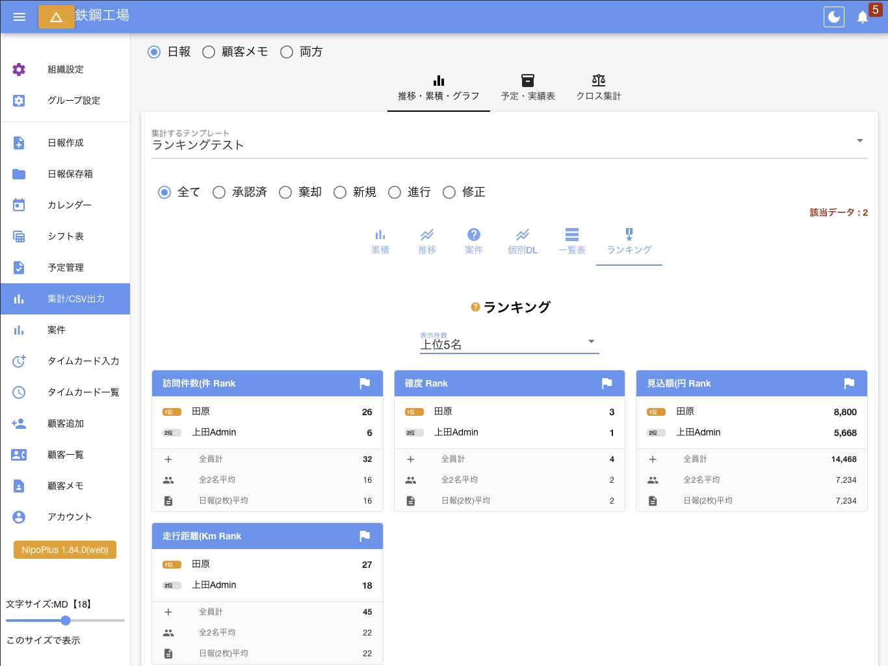

import { Badge, CardGrid } from '@astrojs/starlight/components'
import AutoTopicCard from '@components/AutoTopicCard.astro'
import TopicGrid from '@components/TopicGrid.astro'
import { Steps } from '@astrojs/starlight/components'

<TopicGrid>
  <AutoTopicCard title="日報の状態" href="/nipoplus/reference/reportstate" />
  <AutoTopicCard title="日報を書く" href="/nipoplus/staff/writereport" />
  <AutoTopicCard title="日報のログ" href="/nipoplus/reference/log" />
</TopicGrid>

## ランキング機能について

ランキング機能は日報・チェックシート等のデータを自動で集計し、スタッフ別のランキング形式で表示する機能です。  
旧Nipoでは「集計四太郎」という名称で実装されていた機能ですが、この度NipoPlusにて「ランキング」としてリニューアルされました。
ランキング機能は日報テンプレート入力フォームのうち、次のフォームのデータを集計します。

- [数値入力フォーム](nipoplus/template/digital#commonNumber)
- [レート入力フォーム](nipoplus/template/digital#rate)
- [スライダー入力フォーム](nipoplus/template/digital#slider)
- [算術入力フォーム](nipoplus/template/digital#calc)

## ランキングの使い方

<Steps>

1. 左メニュー「集計/CSV出力」をクリック
2. 集計期間を選択

   デフォルトでは当月が選択されています

3. 推移・累積・グラフをクリック
4. 集計するテンプレートを選択

   ランキングはテンプレート単位で集計されます

5. ランキングをクリック

</Steps>

デフォルトでは「上位１位」のみが表示されます。必要に応じて上位20名まで表示することが可能です。（無料プランは１位のみ表示可能）
