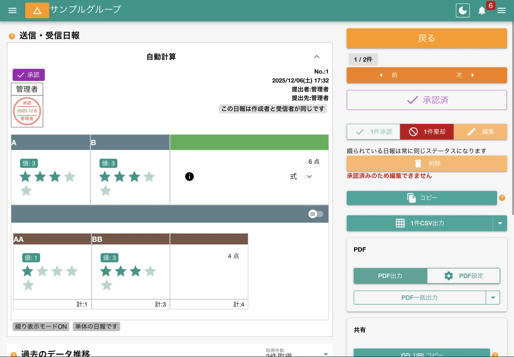
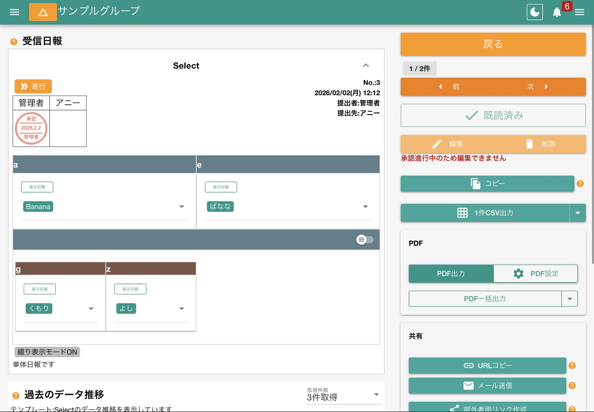

日報の状態は「新規」から始まり、最終的に「承認済み」へ向けて進みます。

各段階の状態は以下のとおりです。

<dl class="basic">
<dt>新規</dt>
<dd>日報が作成され、まだ承認や棄却が行われていない初期状態です</dd>
<dt><a href="/nipoplus/reference/reportstate/#relay">進行</a></dt>
<dd>（提出先が2名以上の場合に限る）1名以上が承認をし、かつ最後の承認がされていない状態です。この状態になると日報はロックされ、直接修正はできません</dd>
<dt><a href="/nipoplus/reference/reportstate/#reject">棄却</a></dt>
<dd>日報が提出先のスタッフによって棄却された状態です。<a href="/nipoplus/reference/redacted">修正が必要</a>です。棄却された理由はコメント欄で確認できます</dd>
<dt><a href="/nipoplus/reference/reportstate/#state">修正</a></dt>
<dd><a href="/nipoplus/reference/redacted">日報を修正</a>した直後で、まだ承認や棄却が行われていない状態です。新規と違い、この状態の日報は削除できません</dd>
<dt><a href="/nipoplus/reference/reportstate/#agree">承認</a></dt>
<dd>全ての提出先スタッフによって承認された最終状態です。日報はロックされ、内容の変更はできません。正式な記録として確定したことを意味します</dd>
</dl>

## 日報の状態を変える {#action}

- [日報の詳細画面](/nipoplus/staff/readreport/)から日報の状態を変化させることができます。
- 提出先に指定されたスタッフには[承認・棄却](/nipoplus/staff/readreport/#agree)ボタンが表示されます
- 共有先に指定されたスタッフには「既読」ボタンが表示されます

[提出先と共有先について](/nipoplus/gainen/destination/)もご覧下さい

### 日報の状態-承認 {#agree}

- 日報の検印欄にあなたの名前があれば、その日報を承認または棄却できます
- 承認すると押印されます
- 検印は左の枠から順番に押印されていきます
- 検印欄の数は[提出先の設定](/nipoplus/gainen/destination)により変動します
- 右端の検印欄に押印された時点で、日報は最終的な「承認」の状態に変わります

### 日報の状態-進行 {#relay}

- あなたの検印欄の右側にさらに検印欄があれば、次の人へ承認権限が回ります
- この時点であなたは承認権限がなくなることに注意してください
- あなたが右端の検印欄である場合は、これで日報が最終的に承認済みとなります

:::note[検印欄が1つしか無い場合はリレーにならず直接承認になります]
:::

### 日報の状態-棄却 {#reject}

- 棄却をクリックした時点で棄却状態となります
- 検印欄には赤丸スラッシュのアイコンが表示されます
- 棄却時に棄却理由を記入できます
- 棄却された日報は[修正](/nipoplus/reference/redacted)の状態を経て、再び承認されていきます
- 状態が「進行」の日報が棄却されると検印欄の最初からやり直しになります
- 棄却された事実は日報の作成者に[通知](/nipoplus/reference/notify)されます

### 日報の状態-修正 {#state}

- 棄却された日報を修正すると修正状態になります
- 棄却前の日報を修正しても同様に修正の状態になります

## 日報の既読について {#readed}

- 既読ボタンはあなたが「[共有先](/nipoplus/gainen/destination)」に指定された日報で表示されます
- 「既読」は、日報を読んだことを示す意思表示です
- 自分が書いた日報は自動で既読済みの状態になります
