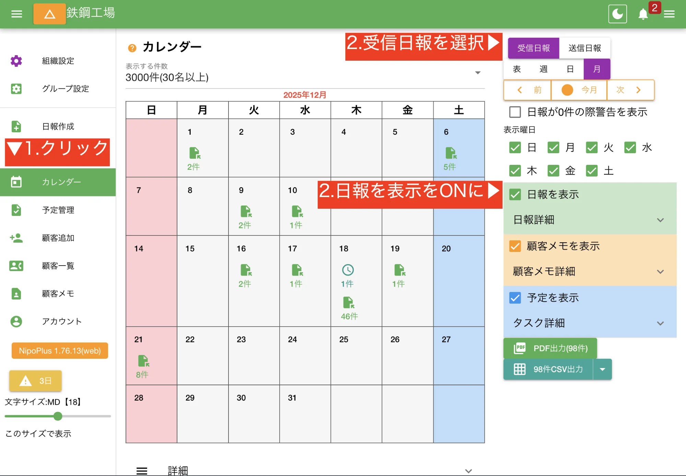
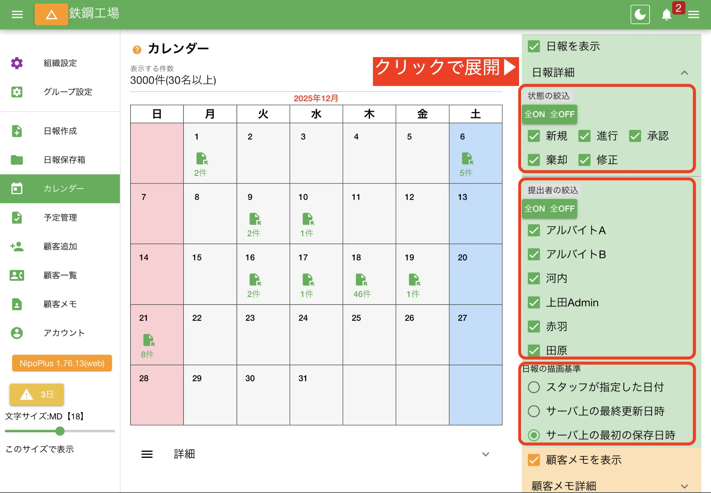
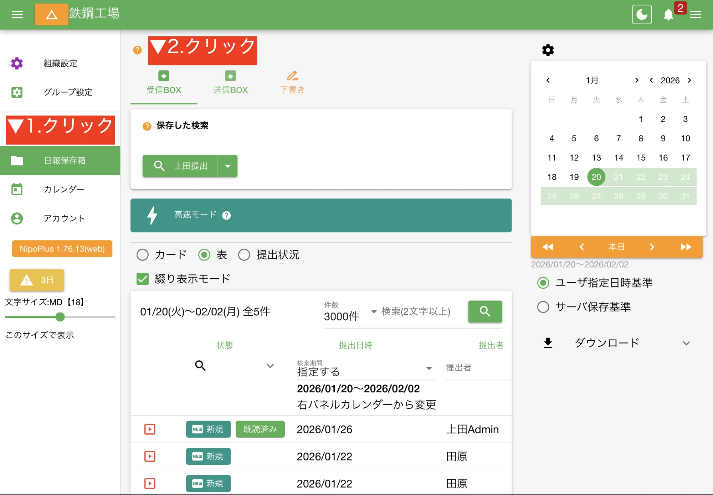
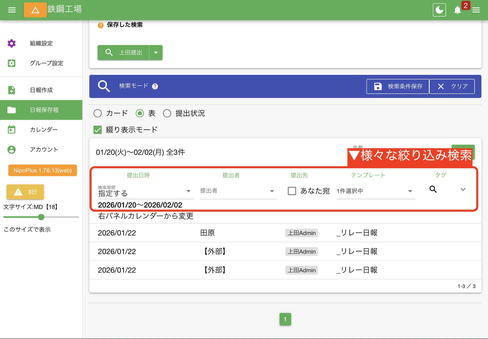

本ページでは日々蓄積されていく日報を効率よく検索する様々な方法についてまとめています。

## 日報へのアクセス方法 {#findReportMethod}

日報へは[受信BOX](/nipoplus/gainen/reportStorage/#inbox)か、カレンダーからアクセスが可能です。また、URLを直接叩くことでも該当日報に直アクセスが可能です。

<dl class="basic">
<dt><a href="#calendar">カレンダーから</a></dt>
<dd>月間カレンダーや週カレンダー上に日報や予定が直感的に表示されます。特定の日付の記録を素早く確認したい場合に便利です</dd>
<dt><a href="#listbox">受信BOXから</a></dt>
<dd>期間指定やフィルタ、キーワード検索など、詳細な条件で目的の日報を絞り込める強力な機能です。NipoPlusの主要な情報探索場所となります</dd>
<dt><a href="/nipoplus/reference/notify">通知メールから</a></dt>
<dd>あなた宛に日報が作成されると通知が発行されます。この通知をクリックすることで直接その日報を閲覧できます。メール通知をONにしている場合はメールからも直接日報を開けます</dd>
</dl>

このうち、[受信BOX](/nipoplus/gainen/reportStorage/#inbox)とカレンダーでは検索や絞り込みがサポートされています。

## カレンダーを使って日報を探す {#calendar}

:::tip[より細かい検索は受信BOX]
カレンダーは絞り込みしかできません。検索には[受信BOX](/nipoplus/gainen/reportStorage/#inbox)を使って下さい。
:::

1.  メニュー「カレンダー」を開く
2.  右パネルの「受信日報」を選択（デフォルトで選択済み）
3.  右パネルの「日報を表示」をON（デフォルトでチェック済み）

この時点ではすべての日報が表示されます。カレンダーでは特定の条件に従って日報を絞り込むことができます。

<dl class="basic">
<dt><a href="/nipoplus/reference/reportstate/">日報の状態</a>を選択して絞り込み</dt>
<dd>承認された日報のみ表示したりできます。複数チェックした場合の条件はORです</dd>
<dt>提出者を選択して絞り込み</dt>
<dd>日報提出者で絞り込みが可能です。複数チェックした場合の条件はORです</dd>
<dt>日報の日付で表示基準を切替</dt>
<dd>提出日や修正日など、複数の日付がありますがどの日付を基準にカレンダーに表示するかを選択できます。<a href="/nipoplus/gainen/reportdate">日付の概念</a>を参照</dd>
</dl>

:::tip[ORとは]
「または」として絞り込まれる方式です。例えば承認と棄却にチェックしたら「承認または棄却された日報」を表示します
:::

## 受信BOXを使って日報を探す {#listbox}

:::caution[[権限](/nipoplus/reference/userRank)がゲスト・書き込みのみの場合は受信BOXにアクセスできません]
:::

受信BOXにはあなたが閲覧可能な日報のみ表示されます。様々な絞り込みや検索が可能です。

1. 左メニュー「日報保存箱」をクリック
2. 上メニュー「受信BOX」をクリック（デフォルトで洗濯済み）

:::tip[表示モードは3種類]
[受信BOX](/nipoplus/gainen/reportStorage/#inbox)は「カード」「表」「[提出状況](/nipoplus/gainen/reportStorage/#map)」の3種類の表示モードが選択可能です
:::

### 表示期間を変更する

右パネルのカレンダーで指定した範囲の日報が表示されます

1.  右パネルのカレンダーから表示したい期間を選択する
2.  表示された一覧から任意の日報をクリック

### タグ・提出者・テンプレート・状態・で絞り込み {#filterd}

:::note[表示モードは「表」ですが他の表示モードでも利用可能です]
:::

タグや提出者、テンプレートといった日報の持つステータス（状態）からマッチするものだけを簡単に絞り込みができます。

<dl class="basic">
<dt>提出日時</dt>
<dd>右上のカレンダーパネルからの操作と連動します</dd>
<dt>提出者</dt>
<dd>日報を書いたスタッフで絞り込みができます。複数指定した場合条件はORになります</dd>
<dt>提出先</dt>
<dd>自分が提出先に指定されている日報のみを絞り込みます</dd>
<dt>テンプレート</dt>
<dd>選択したテンプレートで絞り込みができます。複数指定した場合はORになります</dd>
<dt>タグ</dt>
<dd>日報に付与されたタグで絞り込みできます。複数指定した場合はORになります</dd>
</dl>

### 任意の項目で表示を並べ替え（ソート） {#sort}

:::caution[ソートができるのは表モードのみ]
:::

上記のタグ・提出者・テンプレート・状態はそれぞれ項目をクリックすることで並べ替えがされます。

- １度クリックで昇順ソート
- もう一度クリックで降順ソート
- 他のフィールドをクリックすると前のソートはクリアされる

### キーワード全文検索 {#fulltext_search}

:::caution[２文字以上で検索して下さい]
1文字では検索されません
:::

日報内に書かれた文章フレーズで検索することができます。

1. 検索ボックスに文字を入力
2. 虫眼鏡のボタンをクリック
3. 検索にマッチしたデータが表示（カード表示はマッチ箇所がハイライトされる）

### 検索条件を保存する {#saveQuery}

:::caution[[この機能はGOLDPLAN限定です](/nipoplus/price/#fee)]
:::

検索に指定した条件をそのまま保存できます。次回以降はワンクリックで同じ検索が行えます。

1. 何かしらの検索を行う
2. 「検索モード」バナー内にある「検索条件保存」をクリック
3. 検索名を入力し保存をクリック
4. [受信BOX](/nipoplus/gainen/reportStorage/#inbox)上部に追加されていれば成功

:::tip[日付の相対と絶対]

- 「昨日・先週」といった相対的表現で保存した場合、検索した日に応じて日付範囲も変わります
- 2025/01/01といった絶対的表現で保存した場合は検索した日に関係なく毎回同じ日付で検索がなされます

:::

保存した検索を削除するには以下の手順で行います。

1. 保存された検索の下向き三角ボタンをクリック
2. 削除をクリック

### 検索モードの解除 {#clearQuery}

検索や並べ替えを行うと「検索モード」検索がされていない状態は「高速モード」のバナーがそれぞれ表示されます。
検索モードから高速モードに切り替えるには以下の手順で操作します

1. 検索モードバナー内にあるクリアをクリック
2. バナーが「高速モード」に戻ることを確認する
