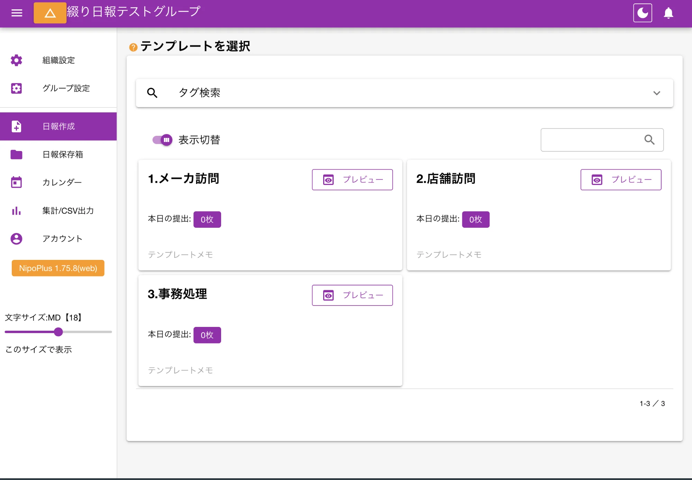
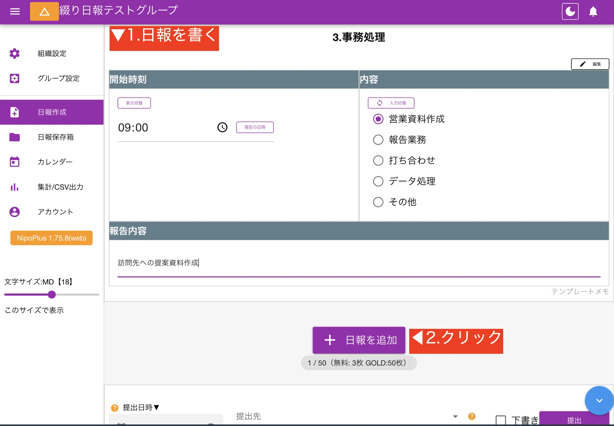
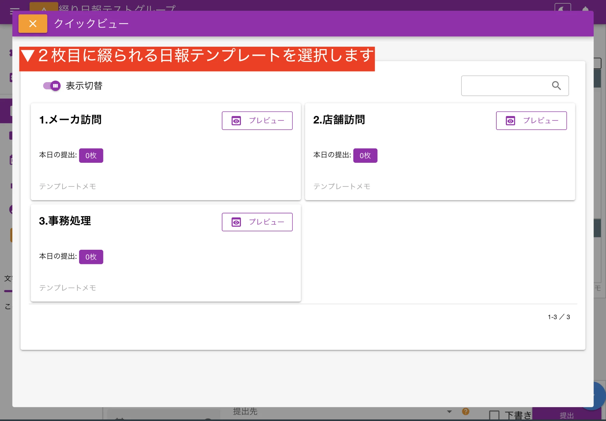
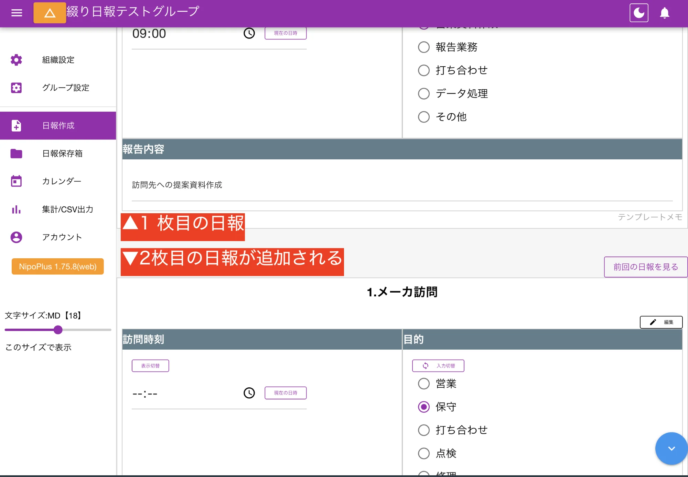
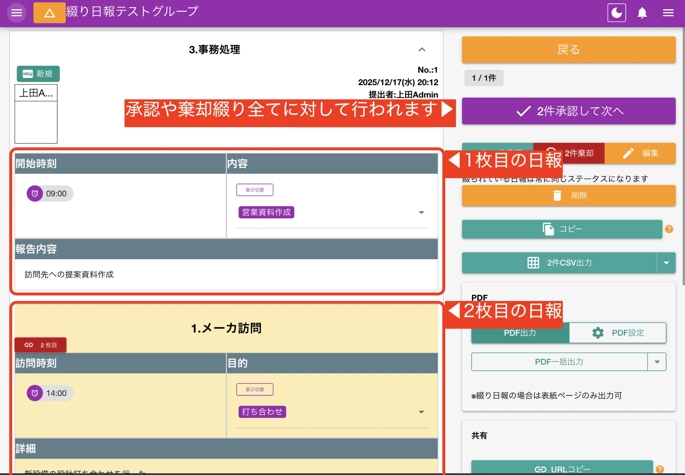

複数枚の日報を1つに綴ることで、データ上は個々の日報ですが、表示上は1つの日報としてまとめて読むことができます。

## ユースケース [#id=usecase]

例えば主たる業務に「店舗訪問」「メーカー訪問」「事務処理」があると仮定し、これらのテンプレートを作成しておきます。
1日の終りに日報を書く際、今日行った3種類の業務を1件ごとにテンプレートを切り替えて作成し、それらを連結することで1日の業務報告をまとめて行うことができます。

## データの扱いについて [#id=data_handling]

- 綴りの日報は複数枚を1枚にまとめますが内部的にはそれぞれが独立した日報です
- 10枚の日報を1つに綴ると、表示上は1件になりますが内部的な日報の件数は10件となります
- 綴りの日報同士は[ステータス](/nipoplus/reference/reportstate/)が同じになります（タグや既読についても同様）

## 使い方 [#id=usage]

1枚目は通常の日報作成と同じ手順で、使用するテンプレートを選択します。例として「店舗訪問」「メーカー訪問」「事務処理」のテンプレートを用意しました。
1枚目は表紙になりますが、どのテンプレートを表紙にしても大きな差は有りません。

例として、午前中に事務処理、午後にメーカ訪問した場合の報告手順を見てみます

まず、最初の報告として事務処理を選択し、日報を書きます。

1枚目の日報が書き終わったら、午後の報告分も一緒に書きます。
「日報を追加」をクリックし、「メーカ訪問テンプレート」を選択します。

この手順の繰り返しで、日報を綴っていきます。ご利用プランによって綴れる上限には差があります。

### 最後に提出ボタンを押下 [#id=submit]

通常の日報と同じで、提出ボタンを押すことで提出が完了します。
2枚綴りの日報の場合、「グループ内の日報総数」は+2とカウントされますが、活動実績の日報提出枚数は+1としてカウントされます。
また、通知などは1件分として発行されます。

## 綴られた日報を読む [#id=read_stitched_report]

綴られた日報は表示上、1件の日報に見えます。
実際は複数の日報をつなげて表示しているだけなので、綴られている日報の各ページごとにアクセスできます。

承認や棄却は1回押すと綴られている日報全てに対して自動で行われます。
より詳細については「日報を読む」のページをご覧ください。
