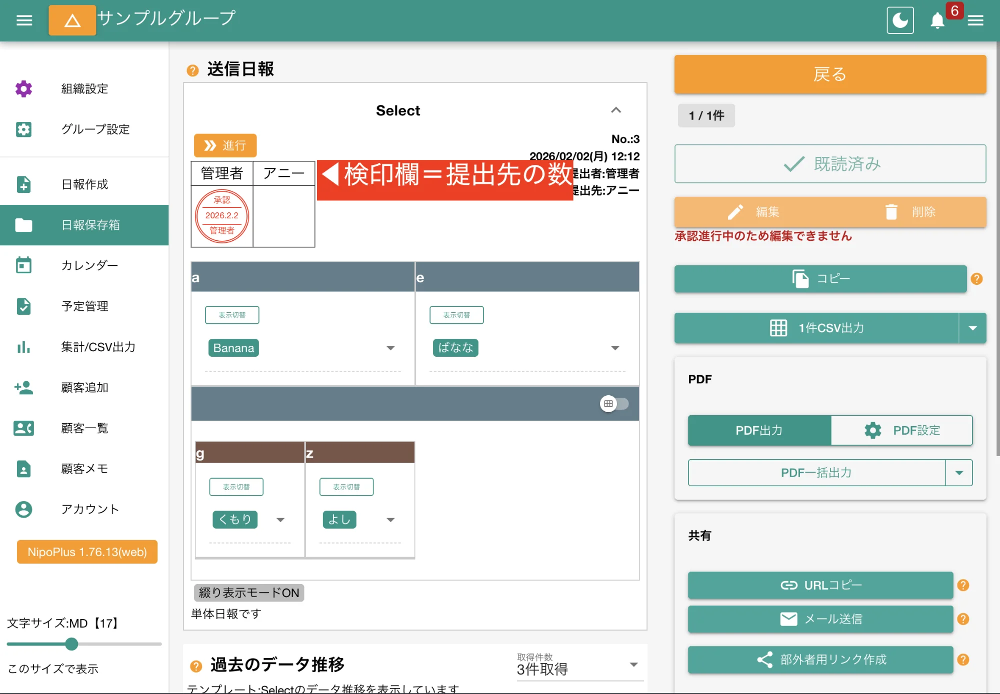

誰が日報を読めるのか？これは提出先と共有先によって決まります。

## 提出先と共有先の意味 {#whatisDist}

１つ１つの日報には提出先と共有先の指定ができます。これは日報作成時に指定しますが、予め管理者が[提出先の固定](/nipoplus/editor/destinationlock)をすることで固定化することもできます。  
どちらもアクセス権限に対する設定ですが、小さな違いがあります。

<dl class="basic">
<dt>提出先</dt>
<dd>日報を<a href="/nipoplus/reference/reportstate/#agree">承認</a>・<a href="/nipoplus/reference/reportstate/#reject">棄却</a>できるスタッフです。1名以上指定必須です。提出先には通知が送られます。 </dd>
<dt>共有先</dt>
<dd>日報を<a href="/nipoplus/reference/reportstate/#readed">閲覧</a>することはできますが、承認・棄却はできません。共有先には通知は送られません。状況把握のみが必要な関係者などに指定します</dd>
</dl>

:::note[提出先にも共有先にも指定されなかったスタッフは、その日報を閲覧できません]

- ※ただし[グループ設定で日報を共有モードにする](/nipoplus/editor/groupmanage/#reportShare)と閲覧ができます。
- ※共有モードの場合、共有先の指定はできなくなります（全員が読めるため）
  :::

## 提出先・共有先の固定化を推奨 {#fixedDist}

このように提出先は日報のアクセス権限に関するものでとても重要です。  
スタッフが誤って別の相手に提出してしまうような事故を防ぐためにも、[提出先の固定](/nipoplus/editor/destinationlock)は行うことを推奨します。

## 提出先の数だけ検印欄が表示され承認リレーが組まれる {#stamp}

- 提出先が複数名いる場合、承認リレーが開始されます
- 承認リレーでは順番に承認を行います
- 承認が可能なスタッフは常に１名です。承認をすると次の提出先に承認権限が移動します
- 承認は承認欄左から進み、右端の検印欄に捺印された時点でその日報が「承認済み」の状態に変わります

承認リレーの流れは次のように進みます

1.  日報を受けて管理者が[日報を承認](/nipoplus/reference/reportstate/#agree)した
2.  この時点で[承認リレー](/nipoplus/reference/reportstate/#relay)が開始され、当該日報は編集がロックされる🔐
3.  管理者はすでに承認したため承認の権限は次の提出先へ移行する
4.  同様の処理が繰り返され、全ての検印欄が埋まると日報が最終的に「承認済み」の状態になる

### グループのモードが共有の場合は承認リレーの運用に留意 {#hint}

- [グループ設定で日報を共有モード](/nipoplus/editor/groupmanage/#reportShare)の場合、承認の順番が回ってくるよりも前に、後続の承認者がその日報を読めてしまう点に留意してください
- 「承認前に上席に読まれてしまうのがまずい」といった厳格な運用が必要な場合は、グループのモードを「通常」にして運用することを推奨します。

### 承認リレーを設定していても先に読みたい場合は共有先にも名前を指定する {#view_before_approval_with_share}

通常、承認リレーが設定されると、前の承認者が承認後に後の承認者が日報を読めるようになります。
しかし、承認プロセスとは別に、情報共有を先行させたい場合もあります。
そのような場合は、「共有先」にも後の承認者の名前や、閲覧させたいスタッフを含めることで、承認前でも日報を閲覧することが可能です。
（ただし、共有先は承認権限を持たないため、既読のみとなります）

### 自動承認について - 個人の記録を効率化 {#autoAgree}

- 提出先の1番目に自分を指定した場合に限り、「自動承認」オプションが使用できます
- 自動承認にチェックを入れて提出することで、自分の日報を提出と同時に自動で承認します
- 承認リレーの場合は２番目の提出先にバトンが渡ります

---

### 提出先の権限をバイパスする {#other_force}

<a href="/nipoplus/editor/staffmanage">グループ内のスタッフ設定</a>で「重役」をONにするとそのアカウントは提出先、共有先の権限をバイパスし、すべての日報にアクセスが可能です。
ただし提出先に指定されていない場合、承認はできません。

### 読めない日報はそもそも存在を検知できません {#hidden_report}

提出先や共有先に名前が無い日報＝読めない日報は、閲覧権限としてあなたが読めない日報であることを意味します。  
読めない日報は[受信BOX](/nipoplus/gainen/reportStorage/#inbox)上や、カレンダー上に「そもそも表示されない」ことに留意してください。存在を認知することすらできません。  
そのため、日報の集計処理でも自身が読めない日報はそもそも集計の対象になりません。

:::note[この特性により見るアカウントによって集計結果が異なる可能性があります]
:::
