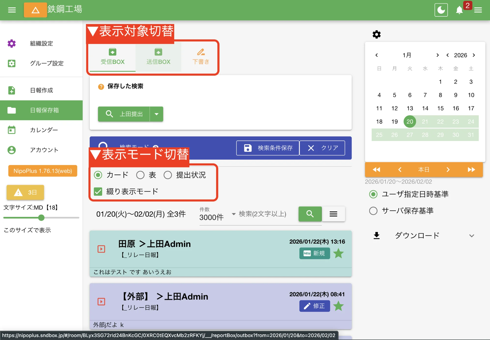
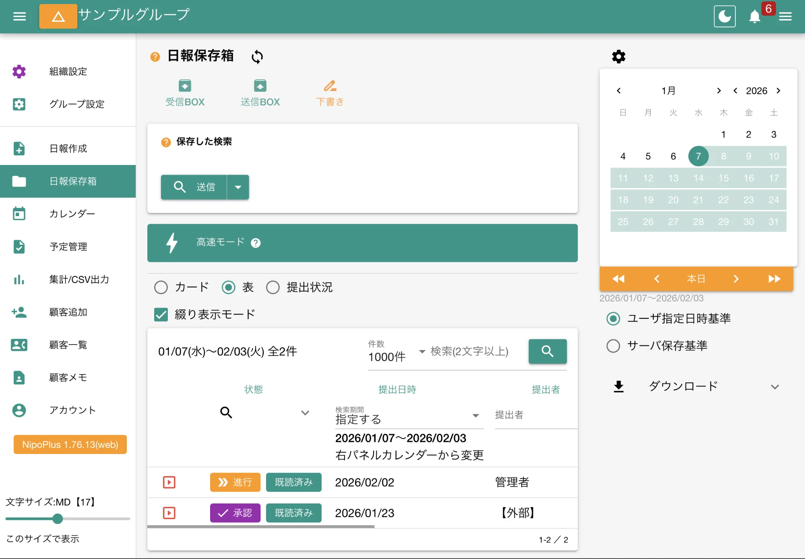
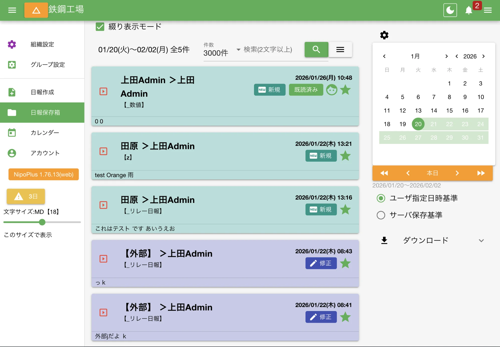
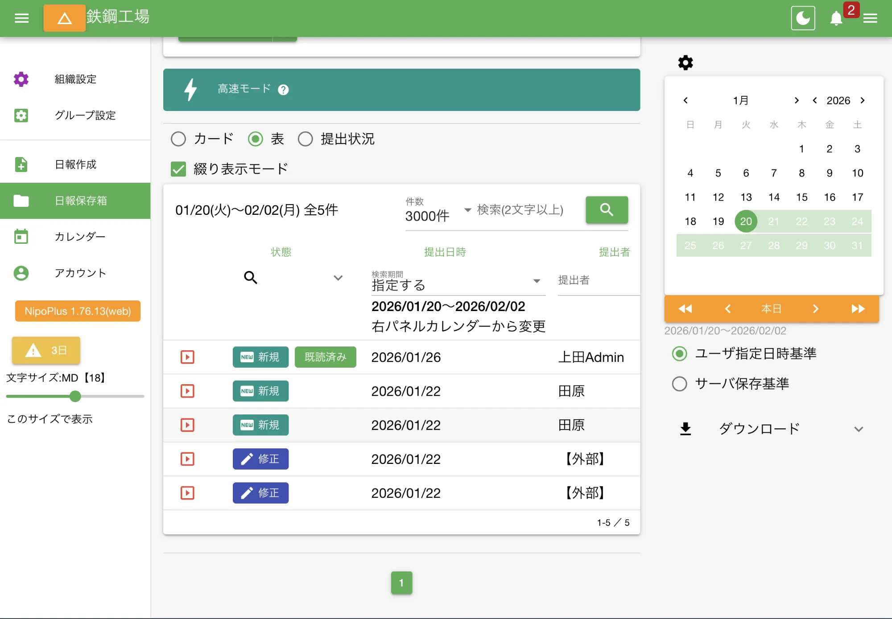

受信BOXは３種類の表示モードが用意されており、簡単に切り替えが可能です

## 表示対象について

表示対象は３種類から切り替え可能です。

<dl class="basic">
<dt>受信BOX</dt>
<dd>あなたが<a href="/nipoplus/gainen/destination/">提出先または共有先</a>に指定された日報、つまりあなたが読める日報が表示されます</dd>
<dt>送信BOX</dt>
<dd>あなたが提出した日報が表示されます</dd>
<dt>下書きBOX</dt>
<dd><a href="/nipoplus/reference/draft/">下書きとして保存した日報</a>が表示されます</dd>
</dl>

:::tip[受信BOXが表示されない権限]
[書き込みのみの権限](/nipoplus/reference/userRank/#others)アカウントは受信BOXが表示されません
:::

### 表示対象-受信BOX {#inbox}

- あなたが読める日報が表示されます
- 自分が書いた自分宛ての日報は受信BOX、送信BOX双方に表示されます
- 検索や絞り込みが可能です

### 表示対象-送信BOX {#outbox}

- あなたが書いた日報が表示されます
- 承認や進行状態でなければ修正や削除が可能です
- 受信BOXに比べて利用できる機能に制限があります

### 表示対象-下書きBOX {#draftbox}

- 下書き保存した日報の一覧が表示されます
- 検索や絞り込みと行った機能は一切使えまえん
- ここにある日報はあなた以外アクセスできない隔離された状態で保管されます

## 表示モードについて

<dl class="basic">
<dt><a href="#card">カード</a></dt>
<dd>縦にカードが並ぶため、スマートフォンに最適な表示モード</dd>
<dt><a href="#table">表</a></dt>
<dd>日報が一覧表で表示される。並べ替えも可能。PCやタブレットに最適</dd>
<dt><a href="#map">提出状況</a></dt>
<dd>日報の提出漏れを書くにする際に便利</dd>
</dl>

:::tip[見え方が変わるだけ]
表示形式は違いますが中身の日報リストは同一です
:::

### 表示モード-カード表示 {#card}

- １件の日報につき１枚のカードで表示されます
- 日報の状態によって色が変わります
- 日報の概要分もカードから確認できます

カードの色は以下の通りです

<table>
  <thead>
    <tr>
      <th>ステータス</th>
      <th>指定色</th>
      <th>分類（参考）</th>
    </tr>
  </thead>
  <tbody>
    <tr>
      <td>承認</td>
      <td style="color: purple;">紫</td>
      <td>日報ステータス</td>
    </tr>
    <tr>
      <td>棄却</td>
      <td style="color: red;">赤</td>
      <td>日報ステータス</td>
    </tr>
    <tr>
      <td>修正</td>
      <td style="color: indigo;">インディゴ</td>
      <td>日報ステータス</td>
    </tr>
    <tr>
      <td>新規</td>
      <td style="color: teal;">緑</td>
      <td>日報ステータス</td>
    </tr>
    <tr>
      <td>進行</td>
      <td style="color: orange;">橙</td>
      <td>日報ステータス</td>
    </tr>
    <tr>
      <td>予定</td>
      <td style="color: purple;">紫</td>
      <td>顧客メモ</td>
    </tr>
    <tr>
      <td>未対応</td>
      <td style="color: orange;">橙</td>
      <td>顧客メモ</td>
    </tr>
    <tr>
      <td>対応中</td>
      <td style="color: green;">深緑</td>
      <td>顧客メモ</td>
    </tr>
    <tr>
      <td>完了</td>
      <td style="color: blue;">青</td>
      <td>顧客メモ</td>
    </tr>
    <tr>
      <td>着手</td>
      <td style="color: #d4af37;">黄</td>
      <td>その他</td>
    </tr>
    <tr>
      <td>破棄</td>
      <td style="color: grey;">灰</td>
      <td>その他</td>
    </tr>
    <tr>
      <td>デフォルト</td>
      <td style="color: brown;">茶</td>
      <td>-</td>
    </tr>
  </tbody>
</table>

### 表示モード-表表示 {#table}

- 表は最も細かい操作に向いている表示モードです
- PCやタブレットなど画面の大きい機器での利用を推奨します

表では唯一並べ替え機能が備わっています。詳しくは[日報検索](/nipoplus/reference/searchreport/#sort)を御覧ください。

### 表示モード-提出状況表示 {#map}

- 提出状況は、その名の通り「日報の提出状況」を表にまとめたものです
- 列に日付、行にスタッフを取った一覧表です
- セルには日報の件数が表示されます。クリックで該当日報をポップアップ表示します
- 提出状況は、検索や表示件数による影響を受けることに注意してください

検索結果に依存する特性を活かして、承認された日報だけの提出状況を把握するなど、目的に合わせた分析が可能です。

:::note[休みか提出漏れか判別するには？]
提出状況表に欠勤やメモを書きたい場合は[シフト表](/nipoplus/reference/shift)をご利用ください。提出状況表とシフト表は連動し、スタッフの勤務状況と日報提出状況を合わせて確認できます
:::

### 提出状況の描画基準を変更する {#switch_base_day}

日報には[３つの日付情報](/nipoplus/gainen/reportdate)があります。
通常、これらの日付は同じものになりますが、その日に日報を書くことが出来ず翌日に前日の日報を書いて提出するというケースもあります。  
例えば8月5日の日報を8月6日に提出すると、その日報は次のように２つの異なる日付情報を持つことになります。
では提出状況はどちらの日付を基準に表示するのでしょう？無料PLANの場合は切り替え出来ませんが、GOLDPLANの方はどちらの日付を使うか切り替えが出来ます。

