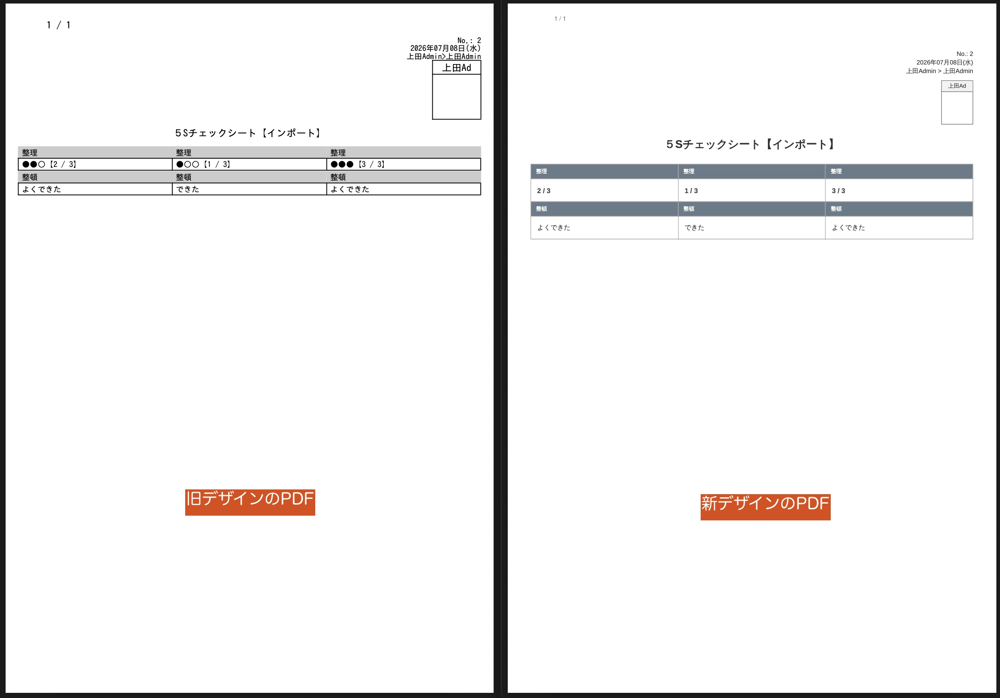

## Version 2.0.0で日報のPDF出力仕様が大きく変わりました

NipoPlusリリース以降、初のメジャーアップデートとなります。
過去のPDF出力は度々不具合がありました。またデザインについても1990年代のような古いデザインで、使い勝手もあまり良くありませんでした。

「おいおい、今は令和の時代だよ？」

はい、おっしゃるとおりです。
より今どきで、より使いやすく、より便利なPDF出力を目指して、今回のアップデートでは大幅な仕様変更を行いました。下の画像は、簡単なテストテンプレートでPDF出力を行った比較です。

旧レイアウトは、昔ながらのテーブルを多用したデザインで、文字の大きさも小さく、見づらい印象でした。
新レイアウトは、文字の大きさを大きくし、余白を増やすことで、より見やすく、より使いやすいデザインに変更しました。
また、旧レイアウトでは、PDF出力の際に文字が切れてしまう不具合がありましたが、新レイアウトではそのような不具合も解消され、より安定したPDF出力が可能になりました。

フッターへ任意の文字を埋め込む機能も実装されております。将来的にはヘッダーへの埋め込みや、フォントの変更など、より多機能に拡張されていく予定です。
今回のアップデートはその第一歩に過ぎません。今後もより便利で、より使いやすいPDF出力を目指して、NipoPlusは進化し続けます。

[リリースノート](/nipoplus/system/release-note/#vp2_0_0)

## 古い様式はVersion 2.0.0で廃止されました

2022/04/22にNipoPlusをリリースして初のメジャーアップデートとなります。
今後、NipoPlusのPDF出力は新しい仕様に統一されます。古い様式のPDF出力は将来にわたってメンテナンスを行うことが現実的に困難であるためです。
古い様式はメンテナンス性が悪く、拡張性にも乏しいため、過去との決別を行い、より使いやすく、より便利な新しい仕様に統一することにしました。
これまで旧デザインに慣れ親しんでいた方には大変申し訳ありませんが、今後は新しい仕様に慣れていただくようお願いいたします。

## 古い様式は古いバージョンで2026年12月31日まで利用可能です

古いデザインでの出力が即座に停止されるわけではありません。2026年12月31日までは、古い様式での出力も引き続きサポートいたします。
古いPDF出力を利用する場合は、NipoPlusのバージョン1.84.0が以下のURLから起動できるので、そちらからご利用下さい。

  <a href="https://nipo-plus-archive-v1-84.web.app/#/" target="_blank" rel="noopener noreferrer">
    Version 1.84.0を起動
  </a>

本番環境と同じE-mailとパスワードでログインが可能です。

なお、Android ／iOS専用アプリでは、ダウングレード機能がないため、古い様式でのPDF出力は利用できません。古い様式でのPDF出力を利用したい場合は、Webブラウザ版のNipoPlusをご利用下さい。

## 使い方は従来とほぼ同じですがマニュアルは鋭意作成中です

使い方は迷うことがないように、これまでのPDF出力とほぼ同じ操作で利用できるように設計されています。
しかし細部で違いがあるため、操作マニュアルを鋭意作成中です。新しいPDF出力の操作方法ガイドページについては、今しばらくお待ちください。
